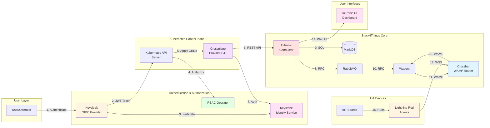
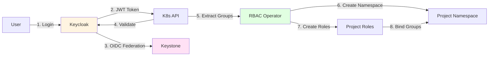
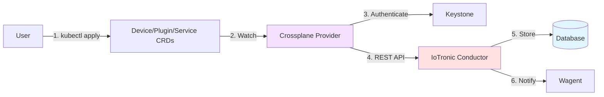
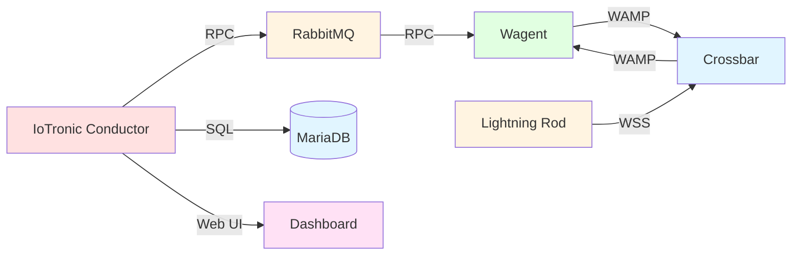
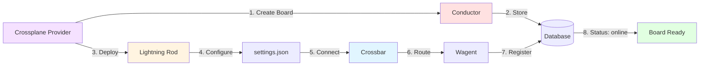
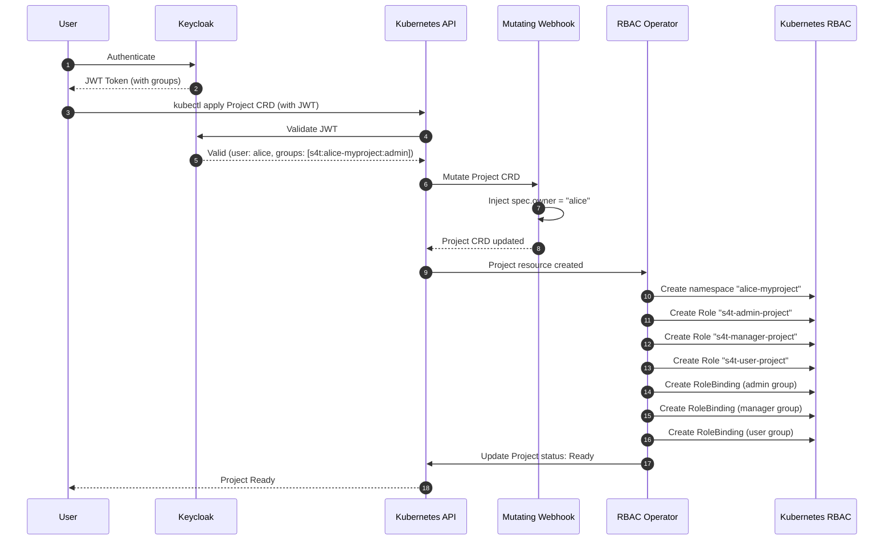
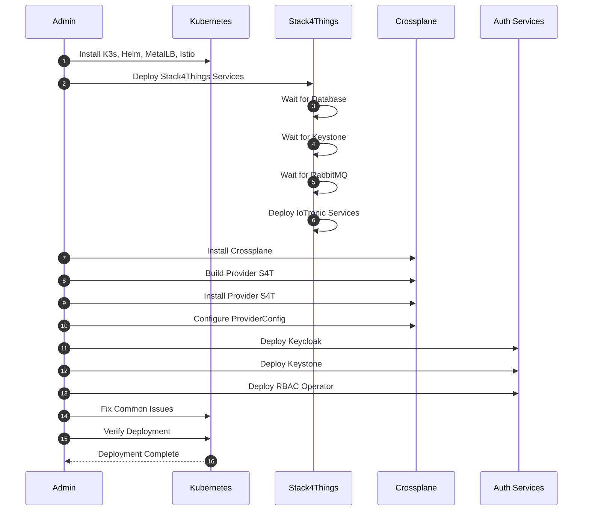
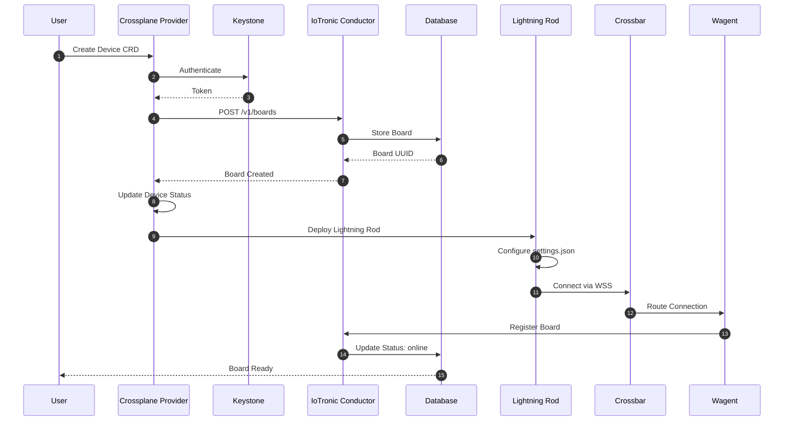
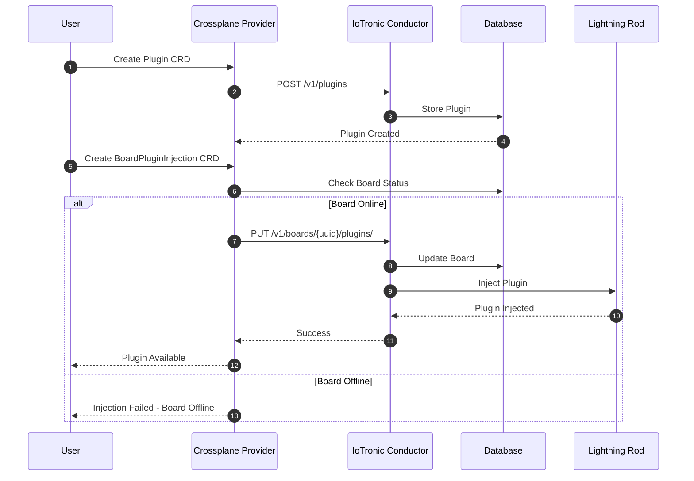
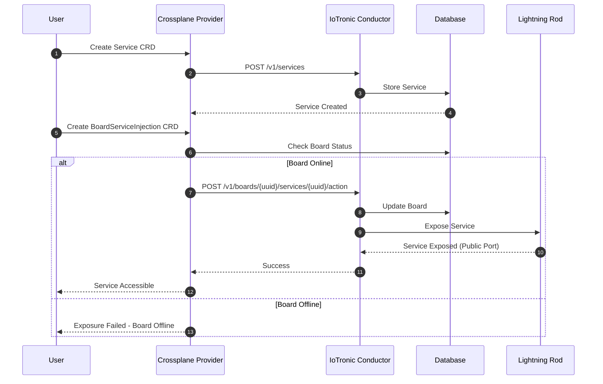

# Stack4Things with Crossplane, Keycloak, and RBAC Deployment

This repository contains the complete deployment of Stack4Things (S4T) integrated with Crossplane for declarative IoT board management on Kubernetes, enhanced with Keycloak for OIDC authentication, Keystone for federated identity, and RBAC Operator for multi-tenant project isolation.

## Table of Contents

- [Repository Structure](#repository-structure)
- [System Overview](#system-overview)
- [Architecture Overview](#architecture-overview)
- [Quick Start](#quick-start)
- [Accessing Dashboards](#accessing-dashboards)
- [Deployment Guide](#deployment-guide)
- [Usage Examples](#usage-examples)
- [Authentication and Authorization](#authentication-and-authorization)
- [Documentation](#documentation)
- [Components](#components)
- [Communication Protocols](#communication-protocols)
- [Getting Help](#getting-help)

## Repository Structure

```
s4t-crossplane-deployment/
├── README.md                          # This file - main documentation
├── stack4things-improved/             # Main deployment directory
│   ├── README.md                      # Detailed deployment guide
│   ├── deploy-complete-improved.sh    # Automated deployment script (includes Crossplane, Keycloak, Keystone, RBAC)
│   ├── scripts/                       # Helper scripts for board management
│   │   ├── create-all-boards.sh      # Create multiple boards
│   │   ├── cleanup-all-boards.sh      # Clean up all boards
│   │   ├── create-plugin.sh          # Create plugin via Crossplane
│   │   ├── inject-plugin-using-crd.sh # Inject plugin into board
│   │   ├── deploy-keycloak-keystone.sh # Deploy Keycloak and Keystone
│   │   ├── deploy-rbac-operator.sh   # Deploy RBAC Operator
│   │   └── configure-k3s-oidc.sh     # Configure k3s for OIDC
│   ├── examples/                      # Example resources
│   │   ├── plugin-simple-logger.yaml  # Simple plugin example
│   │   ├── project-example.yaml       # Project CRD example
│   │   └── ...
│   ├── yaml_file/                     # Kubernetes manifests for S4T services
│   │   ├── keycloak-deployment.yaml   # Keycloak deployment
│   │   ├── keystone-deployment.yaml   # Keystone deployment
│   │   └── ...
│   ├── keycloak-keystone-integration/ # Keycloak and Keystone configurations
│   ├── rbac-operator/                 # RBAC Operator source code
│   └── ...
├── crossplane-provider/               # Crossplane Provider for Stack4Things
│   ├── README.md                      # Provider documentation
│   ├── API_DOCUMENTATION.md           # Complete API reference
│   ├── API_REVIEW.md                  # Provider implementation review
│   ├── openapi.yaml                   # OpenAPI 3.0 specification
│   └── ...
└── stack4things/                      # Legacy deployment (deprecated)
    └── ...                            # Old deployment files
```

## System Overview

Stack4Things is an open-source framework for IoT fleet management that provides:
- Device registration and lifecycle management
- Plugin injection and execution on IoT boards
- Service exposure and management
- Real-time communication via WAMP (WebSocket Application Messaging Protocol)

This deployment enhances Stack4Things with:
- **Crossplane**: Declarative infrastructure management through Kubernetes CRDs
- **Keycloak**: OIDC Identity Provider for Kubernetes authentication
- **Keystone**: Federated identity management with Keycloak
- **RBAC Operator**: Automatic namespace isolation and role-based access control for multi-tenant projects

### Integration Architecture

The system integrates four main layers:

1. **Authentication Layer**: Keycloak provides OIDC tokens for Kubernetes API authentication, federated with Keystone for OpenStack-style identity management
2. **Authorization Layer**: RBAC Operator creates isolated namespaces and role bindings based on OIDC group membership
3. **Resource Management Layer**: Crossplane Provider translates Kubernetes CRDs to Stack4Things API calls
4. **IoT Management Layer**: Stack4Things services manage boards, plugins, and services

## Architecture Overview

### High-Level Architecture

The following simplified diagram shows the main components and their relationships:



### Detailed Architecture Components

#### 1. Authentication & Authorization Layer



**Components:**
- **Keycloak**: OIDC Identity Provider that issues JWT tokens for Kubernetes authentication
- **Keystone**: OpenStack identity service, federated with Keycloak via OIDC
- **RBAC Operator**: Creates isolated namespaces and role bindings based on OIDC group membership

#### 2. Resource Management Layer



**Components:**
- **Crossplane Provider S4T**: Translates Kubernetes CRDs to Stack4Things API calls
- **Device CRD**: Manages IoT boards
- **Plugin CRD**: Manages plugins
- **Service CRD**: Manages services
- **BoardPluginInjection/BoardServiceInjection**: Manages plugin/service injection into boards

#### 3. Stack4Things Core Services



**Components:**
- **IoTronic Conductor**: API server and orchestration engine
- **IoTronic Wagent**: WAMP agent for board communication
- **Crossbar**: WAMP router for real-time messaging
- **Lightning Rod**: Agent running on IoT boards
- **MariaDB**: Database for persistent storage
- **RabbitMQ**: Message broker for RPC communication
- **IoTronic UI**: Web dashboard for management

#### 4. Board Lifecycle Management



## Quick Start

### Prerequisites

Install the following dependencies:

1. **K3s** (Kubernetes distribution):
   ```bash
   curl -sfL https://get.k3s.io | sh -s - --bind-address=0.0.0.0
   sudo chmod 644 /etc/rancher/k3s/k3s.yaml
   export KUBECONFIG=/etc/rancher/k3s/k3s.yaml
   ```

2. **Helm** (Package manager):
   ```bash
   curl -fsSL -o get_helm.sh https://raw.githubusercontent.com/helm/helm/main/scripts/get-helm-3
   chmod 700 get_helm.sh
   ./get_helm.sh
   ```

3. **MetalLB** (LoadBalancer for bare-metal):
   ```bash
   kubectl apply -f https://raw.githubusercontent.com/metallb/metallb/v0.13.10/config/manifests/metallb-native.yaml
   ```

4. **Istio** (Service Mesh):
   ```bash
   helm repo add istio https://istio-release.storage.googleapis.com/charts
   helm repo update
   helm install istio-base istio/base -n istio-system --create-namespace
   helm install istiod istio/istiod -n istio-system --wait
   helm install istio-ingress istio/gateway -n istio-ingress --create-namespace --wait
   ```

For detailed installation instructions, see [Deployment Guide](stack4things-improved/README.md).

### Deployment

Deploy the complete Stack4Things environment with Crossplane, Keycloak, Keystone, and RBAC Operator:

```bash
cd stack4things-improved
./deploy-complete-improved.sh
```

This script automatically:
- Deploys all Stack4Things services (database, Keystone, RabbitMQ, Crossbar, Conductor, Wagent, UI)
- Installs Crossplane
- Builds and installs the Crossplane Provider S4T
- Deploys Keycloak and Keystone for authentication
- Deploys RBAC Operator for project management
- Configures ProviderConfig and credentials
- Fixes common issues automatically

### Post-Deployment Configuration

1. **Configure k3s for OIDC authentication** (optional, for Keycloak integration):
   ```bash
   cd stack4things-improved
   sudo ./scripts/configure-k3s-oidc.sh
   ```

2. **Verify deployment**:
   ```bash
   kubectl get pods -A | grep -E "iotronic|crossplane|keycloak|keystone|controller-manager"
   ```

3. **Access the dashboard** (see [Accessing Dashboards](#accessing-dashboards) section below):
   - Direct NodePort: `http://<server-ip>:31123/horizon`
   - Credentials: `admin` / `s4t`

## Accessing Dashboards

All dashboards are accessible remotely using the server's IP address. You do not need to be on the server itself to access them.

### Getting the Server IP Address

First, determine the IP address of your server:

```bash
# Get the server's IP address
hostname -I | awk '{print $1}'

# Or check the node IP from Kubernetes
kubectl get nodes -o wide
```

The IP address shown will be used to access all dashboards from your remote machine.

### IoTronic UI Dashboard

The IoTronic UI (Horizon) dashboard provides a web interface for managing boards, plugins, and services.

**Access Methods:**

1. **Direct NodePort Access** (Recommended for remote access):
   - Get the server IP address (see above)
   - URL: `http://<server-ip>:31123/horizon`
   - Example: `http://192.168.100.60:31123/horizon`
   - Works immediately after deployment
   - Accessible from any machine on the network

2. **LoadBalancer Access** (if MetalLB is configured):
   - Get the LoadBalancer IP:
```bash
     kubectl get svc istio-ingress -n istio-ingress -o jsonpath='{.status.loadBalancer.ingress[0].ip}'
     ```
   - URL: `http://<loadbalancer-ip>/horizon`
   - Accessible from any machine on the network

**Credentials:**
- Username: `admin`
- Password: `s4t`

**Dashboard Features:**
- View and manage IoT boards
- Create and inject plugins
- Manage services
- Monitor board status (online/offline/registered)
- View plugin execution logs

**Example Remote Access:**
If your server IP is `192.168.100.60`, open in your browser:
```
http://192.168.100.60:31123/horizon
```

### Keycloak Admin Console

Keycloak provides an admin console for managing users, groups, and OIDC clients.

**Access Methods:**

1. **Port Forward with Remote Binding** (Recommended for remote access):
   
   On the server, run:
   ```bash
   kubectl port-forward -n keycloak svc/keycloak 8443:8443 --address 0.0.0.0
   ```
   
   This binds the port-forward to all interfaces (0.0.0.0), making it accessible remotely.
   
   **Important**: Keep this command running in a terminal or run it in the background:
   ```bash
   kubectl port-forward -n keycloak svc/keycloak 8443:8443 --address 0.0.0.0 > /tmp/keycloak-pf.log 2>&1 &
   ```
   
   Then, from your remote machine, access:
   - URL: `https://<server-ip>:8443`
   - Example: `https://100.74.113.72:8443`
   - Accept the self-signed certificate warning in your browser
   
   **Note**: The port-forward will stop if the terminal session ends. For persistent access, use the NodePort method below.

2. **NodePort Service** (For persistent remote access):
   
   Create a NodePort service for Keycloak:
   ```bash
   kubectl patch svc keycloak -n keycloak -p '{"spec":{"type":"NodePort","ports":[{"name":"https","port":8443,"targetPort":8443,"nodePort":30443,"protocol":"TCP"}]}}'
   ```
   
   **Important**: The Keycloak pods must be READY (not just Running) for the NodePort to work. Check pod status:
   ```bash
   kubectl get pods -n keycloak
   kubectl get endpoints keycloak -n keycloak
   ```
   
   If the pods are not READY, wait 5-10 minutes after Keycloak startup, or use the port-forward method above.
   
   Once pods are READY, access from your remote machine:
   - URL: `https://<server-ip>:30443`
   - Example: `https://100.74.113.72:30443`
   - **Important**: Use HTTPS (not HTTP) - Keycloak uses HTTPS on port 8443
   - Accept the self-signed certificate warning in your browser
   
   **Troubleshooting**: If you see "connection refused":
   - Verify the service is type NodePort: `kubectl get svc keycloak -n keycloak`
   - Check that endpoints exist: `kubectl get endpoints keycloak -n keycloak` (should show IP addresses)
   - Verify firewall allows port 30443: `sudo ufw allow 30443/tcp`
   - Check Keycloak pod is READY: `kubectl get pods -n keycloak` (should show `1/1 READY`)

**Credentials:**
- Username: `admin`
- Password: `admin`

**Keycloak Console Features:**
- Manage users and groups
- Configure OIDC clients
- Manage realms
- Configure identity providers
- View authentication logs

**Important Notes:**
- **Keycloak uses HTTPS, not HTTP** - Always use `https://` in the URL, not `http://`
- The port-forward method requires the `kubectl port-forward` command to remain running on the server
- For persistent access without keeping port-forward running, use the NodePort method (recommended)
- Both methods use HTTPS with self-signed certificates - your browser will show a security warning that you need to accept
- Default Keycloak service is ClusterIP only - you must create a NodePort service for remote access

### Troubleshooting Dashboard Access

**Issue: Cannot access IoTronic UI from remote machine**

1. Verify the service is running:
   ```bash
   kubectl get pods -n default -l io.kompose.service=iotronic-ui
   ```

2. Check the NodePort:
   ```bash
   kubectl get svc iotronic-ui-direct -n default
   ```
   Ensure the NodePort is `31123`

3. Verify firewall rules on the server allow access to port 31123:
   ```bash
   # Check if firewall is active
   sudo ufw status
   
   # If firewall is active, allow port 31123
   sudo ufw allow 31123/tcp
   ```

4. Verify the server IP is correct:
   ```bash
   hostname -I
   ```

5. Test connectivity from your remote machine:
   ```bash
   # From your remote machine
   curl http://<server-ip>:31123/horizon
   ```

6. Check if the service is listening on all interfaces:
   ```bash
   kubectl get svc iotronic-ui-direct -n default -o yaml | grep nodePort
   ```

**Issue: Cannot access Keycloak from remote machine**

1. Verify Keycloak pod is running:
   ```bash
   kubectl get pods -n keycloak
   ```

2. Check Keycloak logs:
   ```bash
   kubectl logs -n keycloak -l app=keycloak --tail=50
   ```

3. For port-forward method, ensure you use `--address 0.0.0.0`:
   ```bash
   kubectl port-forward -n keycloak svc/keycloak 8443:8443 --address 0.0.0.0
   ```

4. For NodePort method, verify the service exists and is type NodePort:
   ```bash
   kubectl get svc keycloak -n keycloak
   # Should show type: NodePort and port 30443:8443/TCP
   ```
   
   If the service is still ClusterIP, create NodePort:
   ```bash
   kubectl patch svc keycloak -n keycloak -p '{"spec":{"type":"NodePort","ports":[{"name":"https","port":8443,"targetPort":8443,"nodePort":30443,"protocol":"TCP"}]}}'
   ```

5. Verify firewall allows the NodePort:
   ```bash
   sudo ufw allow 30443/tcp  # If using NodePort 30443
   sudo ufw status
   ```

6. Verify HTTPS connectivity from remote machine (use NodePort, not 8443):
   ```bash
   # From your remote machine (ignore certificate errors)
   curl -k https://<server-ip>:30443
   ```
   
   **Common Error**: If you try `http://` instead of `https://`, you will get connection refused. Always use `https://` for Keycloak.

7. Check Keycloak pod logs if still having issues:
   ```bash
   kubectl logs -n keycloak -l app=keycloak --tail=50
   ```

**General Remote Access Tips:**

- Ensure your server's firewall allows incoming connections on the required ports
- If behind a router/NAT, ensure port forwarding is configured
- Use the server's public IP if accessing from outside the local network
- For production deployments, consider setting up proper TLS certificates instead of self-signed certificates

## Deployment Guide

For detailed deployment instructions, troubleshooting, and configuration options, see the [Deployment Guide](stack4things-improved/README.md).

The deployment guide includes:
- Step-by-step installation instructions
- Architecture diagrams and sequence diagrams
- Board creation and management
- Plugin and service management
- Authentication and project management
- Troubleshooting guide
- Common issues and fixes

## Usage Examples

### Example 1: Create a Project

Create an isolated project environment with automatic namespace and RBAC setup:

```bash
cat <<EOF | kubectl apply -f -
apiVersion: s4t.s4t.io/v1alpha1
kind: Project
metadata:
  name: my-iot-project
spec:
  projectName: my-iot-project
  owner: ""  # Auto-populated by mutating webhook from authenticated user
EOF
```

Verify project creation:
```bash
kubectl get project my-iot-project
kubectl get namespace | grep my-iot-project
kubectl get role,rolebinding -n <project-namespace>
```

### Example 2: Create a Board

Create an IoT board using Crossplane Device CRD:

```bash
cat <<EOF | kubectl apply -f -
apiVersion: iot.s4t.crossplane.io/v1alpha1
kind: Device
metadata:
  name: sensor-board-1
  namespace: default
spec:
  forProvider:
    code: "SENSOR-BOARD-001"
    name: "Temperature Sensor Board"
    type: "virtual"
    location:
    - latitude: "38.1157"
      longitude: "13.3613"
      altitude: "0"
  providerConfigRef:
    name: s4t-provider-domain
EOF
```

Create Lightning Rod for the board:
```bash
cd stack4things-improved
./scripts/create-lightning-rod-for-board.sh SENSOR-BOARD-001
```

### Example 3: Create and Inject a Plugin

Create a plugin:
```bash
cat <<EOF | kubectl apply -f -
apiVersion: iot.s4t.crossplane.io/v1alpha1
kind: Plugin
metadata:
  name: temperature-logger
  namespace: default
spec:
  forProvider:
    name: "Temperature Logger"
    code: |
      from iotronic_lightningrod.modules.plugins import Plugin
      from oslo_log import log as logging
      import time
      import random
      
      LOG = logging.getLogger(__name__)
      
      class Worker(Plugin.Plugin):
          def __init__(self, uuid, name, q_result=None, params=None):
              super(Worker, self).__init__(uuid, name, q_result, params)
              self.interval = int(params.get('interval', 30)) if params else 30
              
          def run(self):
              LOG.info(f"Temperature Logger started")
              iteration = 0
              while self._is_running:
                  temperature = round(20.0 + random.uniform(-5, 10), 1)
                  LOG.info(f"[{iteration}] Temperature: {temperature}°C")
                  iteration += 1
                  time.sleep(self.interval)
              LOG.info("Temperature Logger stopped")
              if self.q_result:
                  self.q_result.put("Logger completed")
    parameters:
      interval: 30
  providerConfigRef:
    name: s4t-provider-domain
  deletionPolicy: Delete
EOF
```

Inject the plugin into a board:
```bash
cd stack4things-improved
./scripts/inject-plugin-using-crd.sh SENSOR-BOARD-001 temperature-logger
```

### Example 4: Create Multiple Boards

Create 5 boards automatically:
```bash
cd stack4things-improved
./scripts/create-all-boards.sh 5
```

### Example 5: Verify System Status

Check all components:
```bash
# Stack4Things services
kubectl get pods -n default | grep iotronic

# Crossplane
kubectl get pods -n crossplane-system

# Keycloak and Keystone
kubectl get pods -n keycloak
kubectl get pods -n keystone

# RBAC Operator
kubectl get pods -n system -l control-plane=controller-manager

# Projects
kubectl get projects.s4t.s4t.io

# Devices
kubectl get device -n default
```

## Authentication and Authorization

### Keycloak OIDC Integration

Keycloak provides OIDC authentication for Kubernetes API server access. Users authenticate with Keycloak and receive JWT tokens that include:
- User identity (`preferred_username`)
- Group memberships (`groups` claim)

### Keystone Federation

Keystone is federated with Keycloak via OIDC, allowing:
- Unified identity management across OpenStack and Kubernetes
- Group mapping from Keycloak to Keystone
- Project and domain management in Keystone

### RBAC Operator

The RBAC Operator automatically manages project isolation:

1. **Project Creation**: When a `Project` CRD is created, the operator:
   - Creates a dedicated namespace
   - Creates three project-level Roles (admin, manager, user)
   - Creates RoleBindings based on OIDC group membership
   - Creates a Keystone authentication Secret

2. **Group Convention**: OIDC groups follow the pattern `s4t:owner-project:role`:
   - `s4t:alice-myproject:admin_iot_project` - Full access
   - `s4t:alice-myproject:manager_iot_project` - Developer access
   - `s4t:alice-myproject:user_iot` - Read-only access

3. **Automatic Isolation**: Each project has its own namespace with isolated resources and RBAC policies.

### Project Management Flow

The following sequence diagram shows how project creation and RBAC setup works:



## Documentation

### Main Documentation Files

- **[Deployment Guide](stack4things-improved/README.md)** - Complete deployment instructions with troubleshooting
- **[API Documentation](crossplane-provider/API_DOCUMENTATION.md)** - Complete reference of all IoTronic API endpoints
- **[API Review](crossplane-provider/API_REVIEW.md)** - Review of Crossplane Provider implementation
- **[OpenAPI Specification](crossplane-provider/openapi.yaml)** - OpenAPI 3.0 spec for Stack4Things API
- **[Crossplane Provider README](crossplane-provider/README.md)** - Provider-specific documentation

### Key Sections in Deployment Guide

- Architecture diagrams and sequence diagrams
- Step-by-step deployment instructions
- Board creation and management
- Plugin and service management
- Authentication and project management
- Troubleshooting guide
- Common issues and fixes

## Components

### Stack4Things Services
- **IoTronic Conductor** - API server and orchestration
- **IoTronic Wagent** - WAMP agent for board communication
- **Crossbar** - WAMP router for real-time messaging
- **Lightning Rod** - Agent running on IoT boards
- **IoTronic UI** - Horizon dashboard for management
- **Keystone** - Authentication service (federated with Keycloak)
- **RabbitMQ** - Message broker for RPC
- **MariaDB** - Database for persistent storage

### Crossplane Integration
- **Crossplane core** - Installed automatically
- **Crossplane Provider S4T** - Custom provider for Stack4Things
- **Device CRD** - For managing boards
- **Plugin CRD** - For managing plugins
- **Service CRD** - For managing services
- **BoardPluginInjection CRD** - For injecting plugins into boards (Tested)
- **BoardServiceInjection CRD** - For exposing services on boards (Tested)

### Authentication & Authorization
- **Keycloak** - OIDC Identity Provider for Kubernetes authentication
- **Keystone** - OpenStack identity service, federated with Keycloak
- **RBAC Operator** - Kubernetes operator for managing S4T Projects with namespace isolation
- **Project CRD** - Custom resource for creating isolated project environments
- **OIDC Groups** - Group-based RBAC following `s4t:owner-project:role` convention

## Deployment Flow

The following sequence diagram shows the complete deployment sequence:



## Board Management Flow

The following sequence diagram shows how boards are created and managed:



## Plugin and Service Injection Flow

The following sequence diagrams show how plugins and services are injected into boards:

### Plugin Injection



### Service Exposure



## Communication Protocols

### WAMP (WebSocket Application Messaging Protocol)
- Used for real-time communication between Lightning Rod and Crossbar
- Protocol: WSS (WebSocket Secure)
- Realm: `s4t`
- Port: 8181
- Endpoint: `wss://crossbar.default.svc.cluster.local:8181/`

### RPC (Remote Procedure Call)
- Used for communication between Wagent and Conductor
- Transport: RabbitMQ (AMQP)
- Pattern: Request-Reply
- Topics: `iotronic.conductor_manager` (Conductor) and `s4t` (Wagent)

### REST API
- Used by Crossplane Provider to interact with IoTronic
- Endpoint: `http://iotronic-conductor:8812/v1`
- Authentication: Keystone tokens

### OIDC (OpenID Connect)
- Used for Kubernetes API authentication
- Provider: Keycloak
- Issuer: `https://keycloak.keycloak.svc.cluster.local:8443/realms/stack4things`
- Client ID: `kubernetes`
- Claims: `preferred_username` (username), `groups` (group memberships)

## Notes

- The `stack4things/` directory contains the legacy deployment and is kept for reference
- The `stack4things-improved/` directory is the active deployment with Crossplane, Keycloak, Keystone, and RBAC integration
- All deployment scripts include Crossplane, Keycloak, Keystone, and RBAC Operator installation and configuration
- Plugin and service injection require boards to be **online** (Lightning Rod connected)
- Project creation requires OIDC authentication if k3s is configured for OIDC

## Getting Help

- Check the [Deployment Guide](stack4things-improved/README.md) for detailed instructions
- Review [API Documentation](crossplane-provider/API_DOCUMENTATION.md) for API reference
- See [API Review](crossplane-provider/API_REVIEW.md) for implementation details
- Check logs: `kubectl logs -n crossplane-system -l pkg.crossplane.io/provider=provider-s4t`
- For dashboard access issues, see [Accessing Dashboards](#accessing-dashboards) section above
- Check Keycloak logs: `kubectl logs -n keycloak -l app=keycloak`
- Check RBAC Operator logs: `kubectl logs -n system -l control-plane=controller-manager`