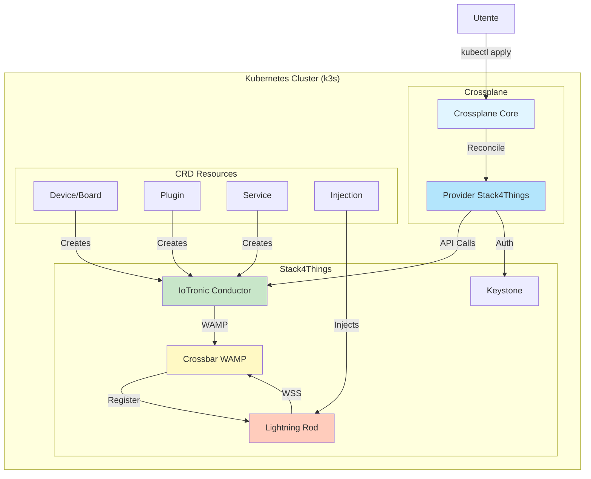
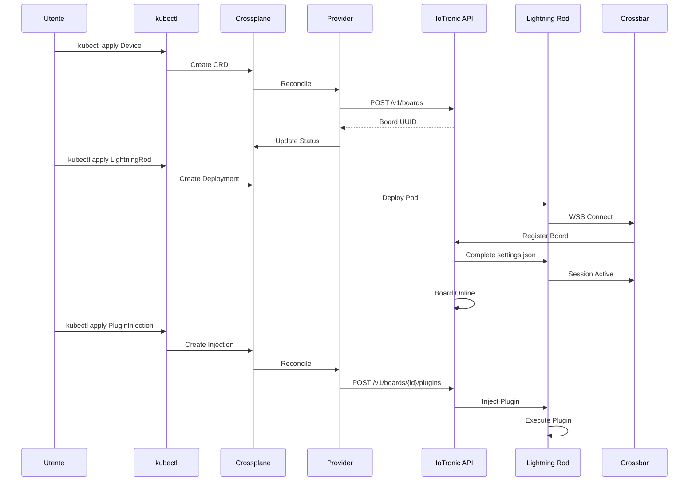
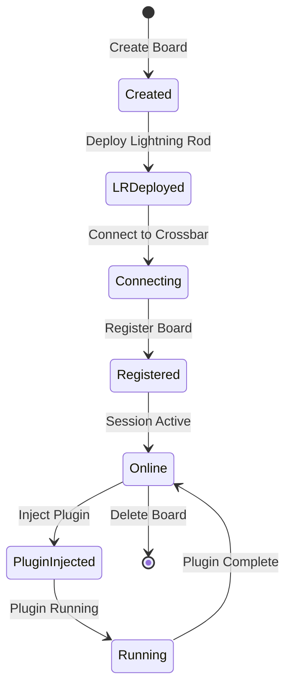

# Stack4Things Crossplane Provider Deployment

Deployment completo di Stack4Things su Kubernetes (k3s) con provider Crossplane per gestione dichiarativa delle risorse IoT.

## Indice

- [Panoramica](#panoramica)
- [Architettura](#architettura)
- [Prerequisiti](#prerequisiti)
- [Deployment Passo-Passo](#deployment-passo-passo)
- [Esperimenti Passo-Passo](#esperimenti-passo-passo)
- [Uso Crossplane](#uso-crossplane)
- [Lightning Rod](#lightning-rod)
- [Esempi](#esempi)
- [Documentazione](#documentazione)
- [Troubleshooting](#troubleshooting)

---

## Panoramica

Questo repository contiene tutto il necessario per:

- **Deploy Stack4Things** su Kubernetes (k3s)
- **Provider Crossplane** personalizzato per gestione dichiarativa
- **Script di automazione** per deployment e test
- **Esempi completi** per tutti i casi d'uso
- **Documentazione** completa e troubleshooting

### Componenti Principali

- **IoTronic Conductor**: API REST principale per gestione board
- **Keystone**: Autenticazione e autorizzazione
- **Crossbar**: WAMP router per comunicazione real-time
- **Lightning Rod**: Agent lato board per connessione
- **Horizon**: Dashboard web
- **Crossplane Provider**: CRD per gestione dichiarativa

---

## Architettura



### Flusso Dati



---

## Prerequisiti

### Software Richiesto

- **Kubernetes**: k3s v1.28+ installato e configurato
- **kubectl**: Configurato per accedere al cluster
- **Docker**: Per build del provider
- **Make**: Per build del provider
- **jq**: Per parsing JSON
- **curl**: Per test API
- **Helm**: 3.x per Istio/Crossplane

### Accesso

- Accesso al repository Stack4Things
- Credenziali Keystone (admin/s4t/admin)
- Permessi per creare risorse Kubernetes

---

## Deployment Passo-Passo

Questa sezione descrive in dettaglio ogni passo del deployment, cosa fa e perché è necessario.

### Step 1: Preparazione Ambiente

**Cosa fa**: Verifica che tutti i prerequisiti siano installati e configurati.

**Comandi**:
```bash
# Verifica k3s
kubectl cluster-info

# Verifica kubectl config
kubectl get nodes

# Verifica Docker
docker --version

# Verifica Make
make --version
```

**Perché necessario**: Assicura che l'ambiente sia pronto per il deployment.

### Step 2: Deployment Stack4Things

**Cosa fa**: Deploya tutti i componenti Stack4Things (IoTronic, Keystone, Crossbar, ecc.) su Kubernetes.

**Comando**:
```bash
cd /home/ubuntu/s4t-crossplane-deployment/stack4things
kubectl apply -f yaml_file/
```

**Cosa viene deployato**:
1. **CA Service**: Genera certificati SSL per Crossbar
2. **Crossbar**: Router WAMP per comunicazione real-time
3. **Keystone**: Servizio di autenticazione
4. **IoTronic Conductor**: API REST principale
5. **IoTronic Database**: Database MySQL
6. **IoTronic UI**: Dashboard Horizon
7. **IoTronic WAgent**: Worker agent
8. **IoTronic WSTun**: WebSocket tunnel

**Tempo atteso**: 60-90 secondi per l'avvio di tutti i pod.

**Verifica**:
```bash
kubectl get pods -n default | grep -E "(iotronic|keystone|crossbar|ca-service)"
```

**Problemi comuni**:
- CA Service non genera certificati: Aggiornare immagine a `debian:bookworm`
- Crossbar in attesa certificati: Attendere che CA Service completi

### Step 3: Verifica Certificati SSL

**Cosa fa**: Verifica che i certificati SSL siano stati generati correttamente dal CA Service.

**Comando**:
```bash
CA_POD=$(kubectl get pod -n default | grep ca-service | awk '{print $1}' | head -1)
kubectl exec -n default "$CA_POD" -- ls -la /etc/ssl/iotronic/
```

**Cosa verificare**:
- `iotronic_CA.key` e `iotronic_CA.pem`: Certificato CA
- `crossbar.key` e `crossbar.pem`: Certificato Crossbar

**Se mancanti**: Riavviare CA Service o aggiornare immagine a `debian:bookworm`.

### Step 4: Verifica Crossbar

**Cosa fa**: Verifica che Crossbar sia avviato e in ascolto sulla porta 8181.

**Comando**:
```bash
CROSSBAR_POD=$(kubectl get pod -n default | grep crossbar | awk '{print $1}' | head -1)
kubectl logs -n default "$CROSSBAR_POD" | grep -E "(listening|8181|started)"
```

**Output atteso**: `Router TCP/8181 transport started` o `listening on TCP port 8181`

**Se non funziona**: Verificare certificati e log per errori.

### Step 5: Deployment Crossplane

**Cosa fa**: Installa Crossplane e il provider Stack4Things.

**Comando**:
```bash
cd /home/ubuntu/s4t-crossplane-deployment
./scripts/deploy-complete-s4t.sh --crossplane-only
```

**Cosa viene deployato**:
1. **Crossplane Core**: Framework Crossplane
2. **Provider Stack4Things**: Provider personalizzato
3. **CRD**: Custom Resource Definitions per Device, Plugin, Service, ecc.

**Tempo atteso**: 30-60 secondi.

**Verifica**:
```bash
kubectl get provider -n default | grep s4t
kubectl get crd | grep "iot.s4t.crossplane.io"
```

**Dovrebbero essere presenti**: 11 CRD.

### Step 6: Configurazione ProviderConfig

**Cosa fa**: Configura le credenziali e l'endpoint per il provider Crossplane.

**File**: `crossplane-provider/cluster/providerconfig.yaml` (se presente)

**Configurazione manuale**:
```yaml
apiVersion: s4t.crossplane.io/v1alpha1
kind: ProviderConfig
metadata:
  name: s4t-provider-domain
spec:
  keystoneEndpoint: "http://keystone:5000/v3"
  secretRef:
    name: s4t-credentials
    namespace: default
```

**Verifica**:
```bash
kubectl get providerconfig s4t-provider-domain -n default
```

### Step 7: Verifica Deployment Completo

**Cosa fa**: Verifica che tutti i componenti siano operativi.

**Comando**:
```bash
./scripts/test-end-to-end.sh --quick
```

**Verifica manuale**:
```bash
# Stack4Things
kubectl get pods -n default | grep -E "(iotronic|keystone|crossbar)" | grep Running

# Crossplane
kubectl get provider -n default | grep s4t
kubectl get crd | grep "iot.s4t.crossplane.io"
```

---

## Esperimenti Passo-Passo

Questa sezione descrive come eseguire esperimenti completi con il sistema.

### Esperimento 1: Creazione Board Virtuale

**Obiettivo**: Creare una board virtuale tramite Crossplane e verificare che sia registrata.

**Step 1: Creare il file YAML**

Crea un file `my-board.yaml`:
```yaml
apiVersion: iot.s4t.crossplane.io/v1alpha1
kind: Device
metadata:
  name: my-first-board
spec:
  forProvider:
    name: "My First Board"
    code: "BOARD-001"
    type: "virtual"
    location:
      - latitude: "45.0"
        longitude: "9.0"
        altitude: "100"
  providerConfigRef:
    name: s4t-provider-domain
  deletionPolicy: Delete
```

**Cosa fa questo YAML**:
- Definisce una risorsa `Device` (board)
- Specifica nome, codice, tipo e posizione
- Riferisce al ProviderConfig per autenticazione

**Step 2: Applicare il YAML**

```bash
kubectl apply -f my-board.yaml
```

**Cosa succede**:
1. Crossplane riceve la richiesta
2. Il provider controller si attiva
3. Chiama l'API IoTronic per creare la board
4. Aggiorna lo status della risorsa

**Step 3: Verificare la creazione**

```bash
# Verifica risorsa Crossplane
kubectl get device my-first-board

# Verifica stato
kubectl get device my-first-board -o yaml | grep -A 10 "status:"

# Ottieni UUID
kubectl get device my-first-board -o jsonpath='{.status.atProvider.uuid}'
```

**Output atteso**: Status `Ready: True` dopo 30-60 secondi.

**Step 4: Verificare via API**

```bash
# Ottieni token
TOKEN=$(./scripts/test-s4t-apis.sh admin s4t admin | grep "Token ottenuto" | cut -d: -f2 | tr -d ' ')

# Ottieni UUID board
BOARD_UUID=$(kubectl get device my-first-board -o jsonpath='{.status.atProvider.uuid}')

# Verifica via API
IOTRONIC_IP=$(kubectl get svc iotronic-conductor -n default -o jsonpath='{.spec.clusterIP}')
IOTRONIC_PORT=$(kubectl get svc iotronic-conductor -n default -o jsonpath='{.spec.ports[0].port}')

curl -H "X-Auth-Token: $TOKEN" \
  "http://${IOTRONIC_IP}:${IOTRONIC_PORT}/v1/boards/$BOARD_UUID" | jq '.'
```

**Output atteso**: Dettagli della board con UUID, code, status.

### Esperimento 2: Creazione Plugin

**Obiettivo**: Creare un plugin Python tramite Crossplane.

**Step 1: Creare il file YAML**

Crea un file `my-plugin.yaml`:
```yaml
apiVersion: iot.s4t.crossplane.io/v1alpha1
kind: Plugin
metadata:
  name: my-first-plugin
spec:
  forProvider:
    name: "My First Plugin"
    code: |
      from iotronic_lightningrod.modules.plugins import Plugin
      from oslo_log import log as logging
      import time
      
      LOG = logging.getLogger(__name__)
      
      class Worker(Plugin.Plugin):
          def __init__(self, uuid, name, q_result=None, params=None):
              super(Worker, self).__init__(uuid, name, q_result, params)
      
          def run(self):
              LOG.info("My First Plugin starting...")
              while (self._is_running):
                  print("Plugin running")
                  time.sleep(5)
    parameters:
      message: "Hello from plugin!"
  providerConfigRef:
    name: s4t-provider-domain
  deletionPolicy: Delete
```

**Cosa fa questo YAML**:
- Definisce una risorsa `Plugin`
- Include codice Python completo
- Specifica parametri per il plugin

**Step 2: Applicare il YAML**

```bash
kubectl apply -f my-plugin.yaml
```

**Step 3: Verificare la creazione**

```bash
# Verifica risorsa
kubectl get plugin my-first-plugin

# Verifica stato
kubectl get plugin my-first-plugin -o jsonpath='{.status.conditions[?(@.type=="Ready")].status}'

# Ottieni UUID
kubectl get plugin my-first-plugin -o jsonpath='{.status.atProvider.uuid}'
```

**Output atteso**: Status `Ready: True` dopo 30-60 secondi.

### Esperimento 3: Creazione Lightning Rod

**Obiettivo**: Creare un Lightning Rod per connettere una board al cloud.

**Prerequisito**: Avere una board creata (Esperimento 1).

**Step 1: Ottenere il board code**

```bash
BOARD_CODE=$(kubectl get device my-first-board -o jsonpath='{.spec.forProvider.code}')
echo "Board code: $BOARD_CODE"
```

**Step 2: Creare Lightning Rod**

```bash
./scripts/create-lightning-rod-for-board.sh "$BOARD_CODE"
```

**Cosa fa lo script**:
1. Crea un Deployment Kubernetes per Lightning Rod
2. Configura `settings.json` con il `board_code`
3. Configura connessione WSS a Crossbar
4. Monta volumi necessari

**Step 3: Verificare il pod**

```bash
kubectl get pods -n default -l board-code="$BOARD_CODE"
```

**Step 4: Monitorare la connessione**

```bash
kubectl logs -n default -l board-code="$BOARD_CODE" -f
```

**Cosa aspettarsi**:
1. `FIRST BOOT: waiting for first configuration...`
2. Tentativi di connessione a Crossbar
3. `settings.json file exception: 'uuid'` (normale, atteso)
4. Connessione stabilita (richiede 5-10 minuti)

**Step 5: Verificare settings.json**

```bash
POD_NAME=$(kubectl get pod -n default -l board-code="$BOARD_CODE" -o jsonpath='{.items[0].metadata.name}')
kubectl exec -n default "$POD_NAME" -- cat /var/lib/iotronic/settings.json | jq '.'
```

**Output iniziale**:
```json
{
  "iotronic": {
    "board": {
      "code": "BOARD-001"
    },
    "wamp": {
      "registration-agent": {
        "url": "wss://crossbar:8181/",
        "realm": "s4t"
      }
    }
  }
}
```

**Dopo connessione**: Il cloud completerà automaticamente con UUID e altri dati.

### Esperimento 4: Verifica Board Online

**Obiettivo**: Verificare che la board sia diventata "online" dopo la connessione Lightning Rod.

**Prerequisito**: Lightning Rod connesso (Esperimento 3, attendere 5-10 minuti).

**Step 1: Ottenere UUID board**

```bash
BOARD_UUID=$(kubectl get device my-first-board -o jsonpath='{.status.atProvider.uuid}')
```

**Step 2: Verificare stato via API**

```bash
TOKEN=$(./scripts/test-s4t-apis.sh admin s4t admin | grep "Token ottenuto" | cut -d: -f2 | tr -d ' ')
IOTRONIC_IP=$(kubectl get svc iotronic-conductor -n default -o jsonpath='{.spec.clusterIP}')
IOTRONIC_PORT=$(kubectl get svc iotronic-conductor -n default -o jsonpath='{.spec.ports[0].port}')

curl -H "X-Auth-Token: $TOKEN" \
  "http://${IOTRONIC_IP}:${IOTRONIC_PORT}/v1/boards/$BOARD_UUID" | \
  jq '{code, status, agent, session}'
```

**Output atteso quando online**:
```json
{
  "code": "BOARD-001",
  "status": "online",
  "agent": {
    "uuid": "...",
    "status": "active"
  },
  "session": {
    "uuid": "...",
    "status": "active"
  }
}
```

**Se non online**: Attendere che Lightning Rod completi la connessione (5-10 minuti).

### Esperimento 5: Iniezione Plugin su Board

**Obiettivo**: Iniettare un plugin su una board online.

**Prerequisiti**:
- Board creata (Esperimento 1)
- Plugin creato (Esperimento 2)
- Board online (Esperimento 4)

**Step 1: Ottenere UUID**

```bash
BOARD_UUID=$(kubectl get device my-first-board -o jsonpath='{.status.atProvider.uuid}')
PLUGIN_UUID=$(kubectl get plugin my-first-plugin -o jsonpath='{.status.atProvider.uuid}')
```

**Step 2: Verificare board online**

```bash
TOKEN=$(./scripts/test-s4t-apis.sh admin s4t admin | grep "Token ottenuto" | cut -d: -f2 | tr -d ' ')
IOTRONIC_IP=$(kubectl get svc iotronic-conductor -n default -o jsonpath='{.spec.clusterIP}')
IOTRONIC_PORT=$(kubectl get svc iotronic-conductor -n default -o jsonpath='{.spec.ports[0].port}')

STATUS=$(curl -s -H "X-Auth-Token: $TOKEN" \
  "http://${IOTRONIC_IP}:${IOTRONIC_PORT}/v1/boards/$BOARD_UUID" | \
  jq -r '.status // .board.status')

if [ "$STATUS" != "online" ]; then
    echo "Board non ancora online. Attendi connessione Lightning Rod."
    exit 1
fi
```

**Step 3: Creare file YAML per injection**

Crea `plugin-injection.yaml`:
```yaml
apiVersion: iot.s4t.crossplane.io/v1alpha1
kind: BoardPluginInjection
metadata:
  name: my-plugin-injection
spec:
  forProvider:
    boardUuid: "<BOARD_UUID>"
    pluginUuid: "<PLUGIN_UUID>"
  providerConfigRef:
    name: s4t-provider-domain
  deletionPolicy: Delete
```

**Step 4: Sostituire UUID e applicare**

```bash
sed -i "s/<BOARD_UUID>/$BOARD_UUID/" plugin-injection.yaml
sed -i "s/<PLUGIN_UUID>/$PLUGIN_UUID/" plugin-injection.yaml

kubectl apply -f plugin-injection.yaml
```

**Step 5: Verificare injection**

```bash
kubectl get boardplugininjection my-plugin-injection

# Verifica stato
kubectl get boardplugininjection my-plugin-injection -o jsonpath='{.status.conditions[?(@.type=="Ready")].status}'
```

**Step 6: Verificare esecuzione plugin**

```bash
BOARD_CODE=$(kubectl get device my-first-board -o jsonpath='{.spec.forProvider.code}')
kubectl logs -n default -l board-code="$BOARD_CODE" | grep -i plugin
```

**Output atteso**: Log del plugin in esecuzione.

### Esperimento 6: Deployment Completo End-to-End

**Obiettivo**: Eseguire un deployment completo usando lo script automatizzato.

**Step 1: Pulizia (opzionale)**

```bash
./scripts/deploy-complete-s4t.sh --cleanup
```

**Cosa fa**: Rimuove tutte le risorse esistenti per partire da zero.

**Step 2: Deployment completo**

```bash
./scripts/deploy-complete-s4t.sh
```

**Cosa fa lo script**:
1. Verifica prerequisiti
2. Deploya Stack4Things
3. Deploya Crossplane Provider
4. Configura ProviderConfig
5. Crea board e Lightning Rod
6. Verifica connessione

**Tempo totale**: 5-10 minuti.

**Step 3: Verifica**

```bash
./scripts/test-end-to-end.sh
```

**Cosa fa lo script**:
1. Verifica infrastruttura
2. Test creazione board
3. Test creazione Lightning Rod
4. Test connessione
5. Test creazione plugin
6. Test injection plugin

---

## Uso Crossplane

### CRD Disponibili

- **Device**: Board/Device IoT
- **Plugin**: Plugin Python eseguibili
- **Service**: Servizi di rete
- **Webservice**: Servizi web
- **BoardPluginInjection**: Iniezione plugin su board
- **BoardServiceInjection**: Iniezione servizio su board
- **Fleet**: Flotte di device
- **Site**: Siti geografici
- **Port**: Porte di comunicazione

### Esempio: Creazione Board

```yaml
apiVersion: iot.s4t.crossplane.io/v1alpha1
kind: Device
metadata:
  name: my-board
spec:
  forProvider:
    name: "My IoT Board"
    code: "BOARD-001"
    type: "virtual"
    location:
      - latitude: "45.0"
        longitude: "9.0"
        altitude: "100"
  providerConfigRef:
    name: s4t-provider-domain
  deletionPolicy: Delete
```

```bash
kubectl apply -f board.yaml
kubectl get device my-board
```

### Esempio: Creazione Plugin

```yaml
apiVersion: iot.s4t.crossplane.io/v1alpha1
kind: Plugin
metadata:
  name: my-plugin
spec:
  forProvider:
    name: "My Plugin"
    code: |
      from iotronic_lightningrod.modules.plugins import Plugin
      from oslo_log import log as logging
      import time
      
      LOG = logging.getLogger(__name__)
      
      class Worker(Plugin.Plugin):
          def __init__(self, uuid, name, q_result=None, params=None):
              super(Worker, self).__init__(uuid, name, q_result, params)
      
          def run(self):
              LOG.info("Plugin starting...")
              while (self._is_running):
                  print("Plugin running")
                  time.sleep(5)
    parameters:
      message: "Hello from plugin!"
  providerConfigRef:
    name: s4t-provider-domain
  deletionPolicy: Delete
```

### Esempio: Iniezione Plugin

```yaml
apiVersion: iot.s4t.crossplane.io/v1alpha1
kind: BoardPluginInjection
metadata:
  name: my-plugin-injection
spec:
  forProvider:
    boardUuid: "<board-uuid>"
    pluginUuid: "<plugin-uuid>"
  providerConfigRef:
    name: s4t-provider-domain
  deletionPolicy: Delete
```

**Nota**: L'iniezione richiede che la board sia **online** (Lightning Rod connesso).

---

## Lightning Rod

### Creazione Lightning Rod

Lightning Rod viene creato usando lo script:

```bash
BOARD_CODE=$(kubectl get device my-board -o jsonpath='{.spec.forProvider.code}')
./scripts/create-lightning-rod-for-board.sh "$BOARD_CODE"
```

### Configurazione

Il file `settings.json` viene creato automaticamente:

```json
{
  "iotronic": {
    "board": {
      "code": "BOARD-001"
    },
    "wamp": {
      "registration-agent": {
        "url": "wss://crossbar:8181/",
        "realm": "s4t"
      }
    }
  }
}
```

### Flusso Connessione



**Tempo atteso**: 5-10 minuti per connessione completa

### Monitoraggio

```bash
# Monitora log Lightning Rod
BOARD_CODE="BOARD-001"
kubectl logs -n default -l board-code="$BOARD_CODE" -f

# Verifica stato board
TOKEN=$(./scripts/test-s4t-apis.sh admin s4t admin | grep "Token ottenuto" | cut -d: -f2 | tr -d ' ')
BOARD_UUID=$(kubectl get device my-board -o jsonpath='{.status.atProvider.uuid}')
curl -H "X-Auth-Token: $TOKEN" \
  http://$(kubectl get svc iotronic-conductor -o jsonpath='{.spec.clusterIP}'):8812/v1/boards/$BOARD_UUID | \
  jq '{code, status, agent, session}'
```

---

## Esempi

### Esempi Disponibili

- **Basic**: Esempi base per ogni risorsa (`examples/sample/`)
- **Advanced**: Esempi avanzati con configurazioni complete (`examples/advanced/`)
- **Complete**: Esempio end-to-end completo (`examples/complete/`)

```bash
# Esempio base
kubectl apply -f crossplane-provider/examples/sample/device-test.yaml

# Esempio avanzato
kubectl apply -f crossplane-provider/examples/advanced/01-plugin-creation.yaml

# Esempio completo end-to-end
kubectl apply -f crossplane-provider/examples/complete/end-to-end-example.yaml
```

### Esempio Completo End-to-End

Vedi `crossplane-provider/examples/complete/` per un esempio completo che include:
- Creazione Device (Board)
- Creazione Plugin
- Creazione Service
- Iniezione Plugin e Service

---

## Documentazione

### Documentazione Disponibile

- **[Documentazione Completa](docs/DOCUMENTAZIONE-COMPLETA.md)**: Guida completa con architettura, deployment, troubleshooting, e note tecniche

### Script Disponibili

- **`scripts/deploy-complete-s4t.sh`**: Deployment completo
  - `--cleanup`: Pulizia completa prima del deployment
  - `--stack4things-only`: Solo Stack4Things
  - `--crossplane-only`: Solo Crossplane Provider
  - `--board-only`: Solo Board e Lightning Rod
  
- **`scripts/test-end-to-end.sh`**: Test completo end-to-end
  - `--quick`: Test rapido infrastruttura
  - `--advanced`: Test esempi avanzati
  - Senza opzioni: Test completo
  
- **`scripts/create-lightning-rod-for-board.sh`**: Creazione Lightning Rod per board
  
- **`scripts/test-s4t-apis.sh`**: Test API Stack4Things (Keystone + IoTronic)

---

## Troubleshooting

### Problema: Crossbar non avvia

**Sintomi**: Crossbar in attesa certificati SSL

**Soluzione**:
```bash
# Verifica servizio CA
kubectl get pod -n default | grep ca-service

# Riavvia servizio CA (se usa debian:buster, aggiorna a debian:bookworm)
kubectl delete deployment ca-service
# Applica deployment aggiornato con debian:bookworm
```

### Problema: Lightning Rod non si connette

**Sintomi**: "Connection refused" o "FIRST BOOT: waiting for first configuration..."

**Soluzione**:
1. Verifica Crossbar funzionante
2. Verifica connettività
3. Verifica settings.json
4. Attendi: La connessione richiede 5-10 minuti

### Problema: Board non diventa online

**Sintomi**: Board rimane in stato "registered"

**Soluzione**:
1. Verifica Lightning Rod connesso
2. Verifica agent e session
3. Attendi connessione completa

### Problema: Plugin injection fallisce

**Sintomi**: "Board is not connected" o "Board is not online"

**Soluzione**:
1. Verifica board online
2. Attendi connessione completa (5-10 minuti)
3. Riprova injection dopo che board è online

Vedi [Documentazione Completa](docs/DOCUMENTAZIONE-COMPLETA.md) per troubleshooting dettagliato.

---

## Testing

### Test End-to-End

```bash
./scripts/test-end-to-end.sh
```

Il test verifica:
- Infrastruttura Stack4Things
- Crossplane Provider
- Creazione board via Crossplane
- Creazione Lightning Rod
- Connessione
- Creazione plugin
- Iniezione plugin

### Test Manuali

```bash
# Test infrastruttura
kubectl get pods -n default | grep -E "(iotronic|keystone|crossbar)"

# Test Crossplane
kubectl get device,plugin,service -n default

# Test API
TOKEN=$(./scripts/test-s4t-apis.sh admin s4t admin | grep "Token ottenuto" | cut -d: -f2 | tr -d ' ')
curl -H "X-Auth-Token: $TOKEN" \
  http://$(kubectl get svc iotronic-conductor -o jsonpath='{.spec.clusterIP}'):8812/v1/boards
```

---

## Build Provider

### Build Locale

```bash
cd crossplane-provider
make build
```

### Build e Push Docker Image

```bash
cd crossplane-provider
make docker-build
make docker-push IMG=<registry>/s4t-provider:<tag>
```

### Deploy Provider

```bash
cd crossplane-provider
kubectl apply -f cluster/
```

---

## Struttura Repository

```
s4t-crossplane-deployment/
├── README.md                    # Questo file
├── crossplane-provider/         # Provider Crossplane
│   ├── examples/               # Esempi YAML
│   │   ├── sample/            # Esempi base
│   │   ├── advanced/          # Esempi avanzati
│   │   └── complete/          # Esempi end-to-end
│   ├── cluster/               # Manifest Kubernetes
│   └── internal/              # Codice Go
├── stack4things/               # Deployment Stack4Things
│   └── yaml_file/             # Manifest Kubernetes
├── scripts/                    # Script di deployment
│   ├── deploy-complete-s4t.sh
│   ├── test-end-to-end.sh
│   ├── create-lightning-rod-for-board.sh
│   └── test-s4t-apis.sh
└── docs/                       # Documentazione
    └── DOCUMENTAZIONE-COMPLETA.md
```

---

## Contribuire

### Come Contribuire

1. Fork del repository
2. Crea un branch per la feature (`git checkout -b feature/AmazingFeature`)
3. Commit delle modifiche (`git commit -m 'Add some AmazingFeature'`)
4. Push al branch (`git push origin feature/AmazingFeature`)
5. Apri una Pull Request

### Standard di Codice

- Segui le convenzioni Go per il provider
- Aggiungi test per nuove funzionalità
- Aggiorna documentazione
- Aggiungi esempi per nuovi CRD

---

## Supporto

Per problemi o domande:
1. Consulta [Troubleshooting](#troubleshooting)
2. Verifica [Documentazione Completa](docs/DOCUMENTAZIONE-COMPLETA.md)
3. Apri una issue su GitHub

---

**Ultimo aggiornamento**: 2025-12-03
