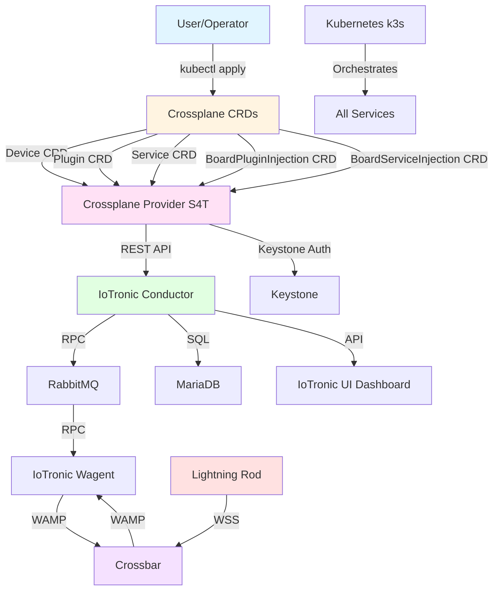
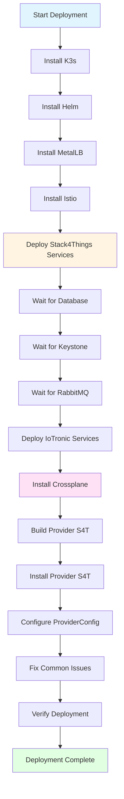
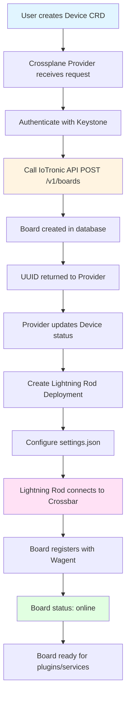

# Stack4Things with Crossplane Deployment

This repository contains the complete deployment of Stack4Things (S4T) integrated with Crossplane for declarative IoT board management on Kubernetes.

## Table of Contents

- [Repository Structure](#repository-structure)
- [Architecture Overview](#architecture-overview)
- [Quick Start](#quick-start)
- [Documentation](#documentation)
- [Components](#components)
- [Deployment Flow](#deployment-flow)
- [Board Management Flow](#board-management-flow)
- [Plugin and Service Injection Flow](#plugin-and-service-injection-flow)
- [Communication Protocols](#communication-protocols)
- [Getting Help](#getting-help)

## Repository Structure

```
s4t-crossplane-deployment/
├── README.md                          # This file - main documentation
├── stack4things-improved/             # Main deployment directory
│   ├── README.md                      # Detailed deployment guide
│   ├── deploy-complete-improved.sh    # Automated deployment script (includes Crossplane)
│   ├── scripts/                       # Helper scripts for board management
│   │   ├── create-all-boards.sh      # Create multiple boards
│   │   ├── cleanup-all-boards.sh      # Clean up all boards
│   │   ├── create-plugin.sh          # Create plugin via Crossplane
│   │   ├── inject-plugin-using-crd.sh # Inject plugin into board
│   │   └── ...
│   ├── examples/                      # Example resources
│   │   ├── plugin-simple-logger.yaml  # Simple plugin example
│   │   └── ...
│   ├── yaml_file/                     # Kubernetes manifests for S4T services
│   ├── conf_*/                        # Configuration files
│   └── ...
├── crossplane-provider/               # Crossplane Provider for Stack4Things
│   ├── README.md                      # Provider documentation
│   ├── API_DOCUMENTATION.md           # Complete API reference
│   ├── API_REVIEW.md                  # Provider implementation review
│   ├── openapi.yaml                   # OpenAPI 3.0 specification
│   ├── examples/                      # Example Device/Plugin/Service resources
│   └── ...
└── stack4things/                      # Legacy deployment (deprecated)
    └── ...                            # Old deployment files
```

## Architecture Overview

The following diagram shows the high-level architecture of Stack4Things with Crossplane integration:



## Quick Start

1. **Prerequisites**: Install K3s, Helm, MetalLB, and Istio (see [Deployment Guide](stack4things-improved/README.md))

2. **Deploy Stack4Things with Crossplane**:
   ```bash
   cd stack4things-improved
   ./deploy-complete-improved.sh
   ```

   This script automatically:
   - Deploys all Stack4Things services
   - Installs Crossplane
   - Builds and installs the Crossplane Provider S4T
   - Configures ProviderConfig
   - Fixes common issues automatically

3. **Create boards using Crossplane**:
   ```bash
   cd stack4things-improved
   ./scripts/create-all-boards.sh 5
   ```

## Documentation

### Main Documentation Files

- **[Deployment Guide](stack4things-improved/README.md)** - Complete deployment instructions with troubleshooting
- **[API Documentation](crossplane-provider/API_DOCUMENTATION.md)** - Complete reference of all IoTronic API endpoints
- **[API Review](crossplane-provider/API_REVIEW.md)** - Review of Crossplane Provider implementation
- **[OpenAPI Specification](crossplane-provider/openapi.yaml)** - OpenAPI 3.0 spec for Stack4Things API
- **[Crossplane Provider README](crossplane-provider/README.md)** - Provider-specific documentation

### Key Sections in Deployment Guide

- Architecture diagrams and sequence diagrams
- Step-by-step deployment instructions
- Board creation and management
- Plugin and service management
- Troubleshooting guide
- Common issues and fixes

## Components

### Stack4Things Services
- **IoTronic Conductor** - API server and orchestration
- **IoTronic Wagent** - WAMP agent for board communication
- **Crossbar** - WAMP router for real-time messaging
- **Lightning Rod** - Agent running on IoT boards
- **IoTronic UI** - Horizon dashboard for management
- **Keystone** - Authentication service
- **RabbitMQ** - Message broker for RPC
- **MariaDB** - Database for persistent storage

### Crossplane Integration
- **Crossplane core** - Installed automatically
- **Crossplane Provider S4T** - Custom provider for Stack4Things
- **Device CRD** - For managing boards
- **Plugin CRD** - For managing plugins
- **Service CRD** - For managing services
- **BoardPluginInjection CRD** - For injecting plugins into boards ✅ Tested
- **BoardServiceInjection CRD** - For exposing services on boards ✅ Tested

## Deployment Flow

The following diagram shows the complete deployment sequence:



## Board Management Flow

The following diagram shows how boards are created and managed:



## Plugin and Service Injection Flow

The following diagram shows how plugins and services are injected into boards:

```mermaid
flowchart TD
    A[User creates Plugin CRD] --> B[Crossplane Provider creates plugin]
    B --> C[Plugin stored in database]
    
    D[User creates BoardPluginInjection CRD] --> E[Provider calls PUT /v1/boards/{uuid}/plugins/]
    E --> F{Board online?}
    F -->|Yes| G[Plugin injected successfully]
    F -->|No| H[Injection fails - board offline]
    
    G --> I[Plugin appears in dashboard]
    I --> J[User can start plugin]
    
    K[User creates Service CRD] --> L[Crossplane Provider creates service]
    L --> M[Service stored in database]
    
    N[User creates BoardServiceInjection CRD] --> O[Provider calls POST /v1/boards/{uuid}/services/{uuid}/action]
    O --> P{Board online?}
    P -->|Yes| Q[Service exposed with public port]
    P -->|No| R[Exposure fails - board offline]
    
    Q --> S[Service accessible via public port]
    
    style A fill:#e1f5ff
    style D fill:#e1f5ff
    style K fill:#e1f5ff
    style N fill:#e1f5ff
    style G fill:#e1ffe1
    style Q fill:#e1ffe1
    style H fill:#ffe1e1
    style R fill:#ffe1e1
```

## Communication Protocols

### WAMP (WebSocket Application Messaging Protocol)
- Used for real-time communication between Lightning Rod and Crossbar
- Protocol: WSS (WebSocket Secure)
- Realm: `s4t`
- Port: 8181

### RPC (Remote Procedure Call)
- Used for communication between Wagent and Conductor
- Transport: RabbitMQ (AMQP)
- Pattern: Request-Reply
- Topics: `iotronic.conductor_manager` (Conductor) and `s4t` (Wagent)

### REST API
- Used by Crossplane Provider to interact with IoTronic
- Endpoint: `http://iotronic-conductor:8812/v1`
- Authentication: Keystone tokens

## Notes

- The `stack4things/` directory contains the legacy deployment and is kept for reference
- The `stack4things-improved/` directory is the active deployment with Crossplane integration
- All deployment scripts include Crossplane installation and configuration
- Plugin and service injection require boards to be **online** (Lightning Rod connected)

## Getting Help

- Check the [Deployment Guide](stack4things-improved/README.md) for detailed instructions
- Review [API Documentation](crossplane-provider/API_DOCUMENTATION.md) for API reference
- See [API Review](crossplane-provider/API_REVIEW.md) for implementation details
- Check logs: `kubectl logs -n crossplane-system -l pkg.crossplane.io/provider=provider-s4t`
