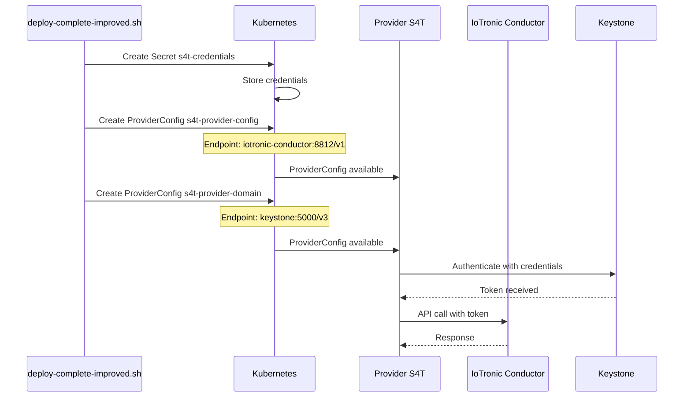
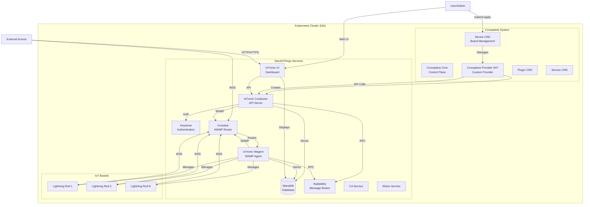
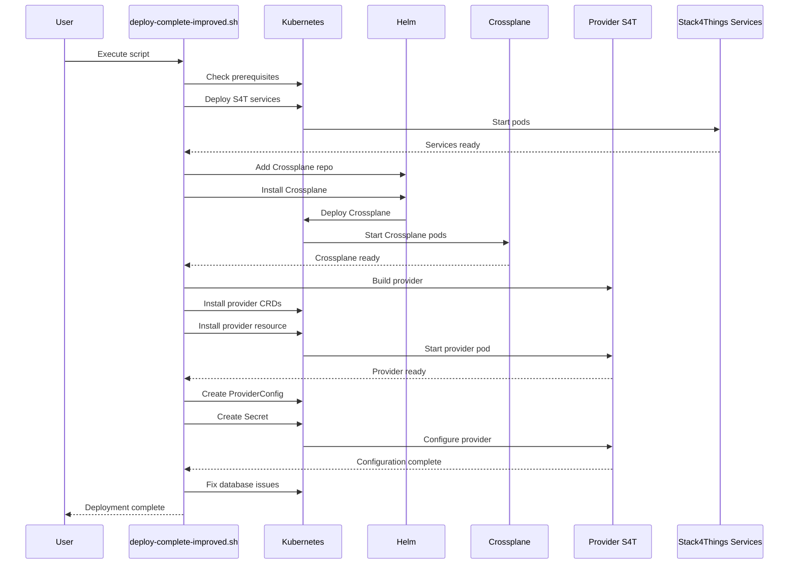
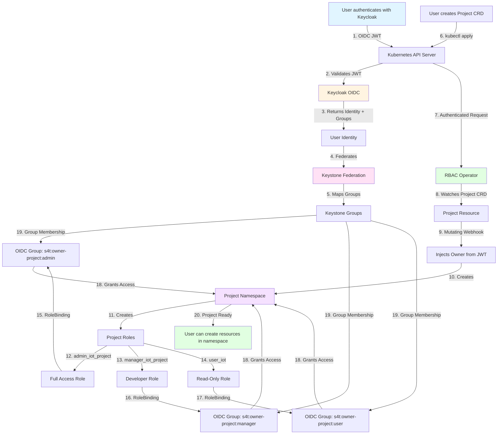
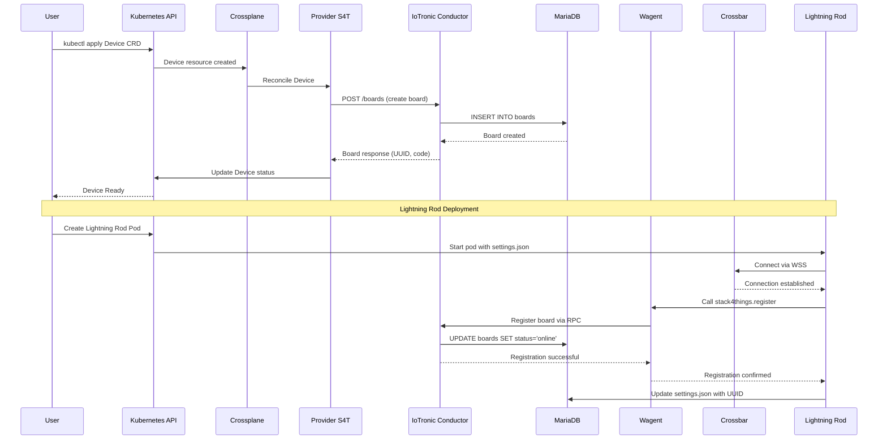
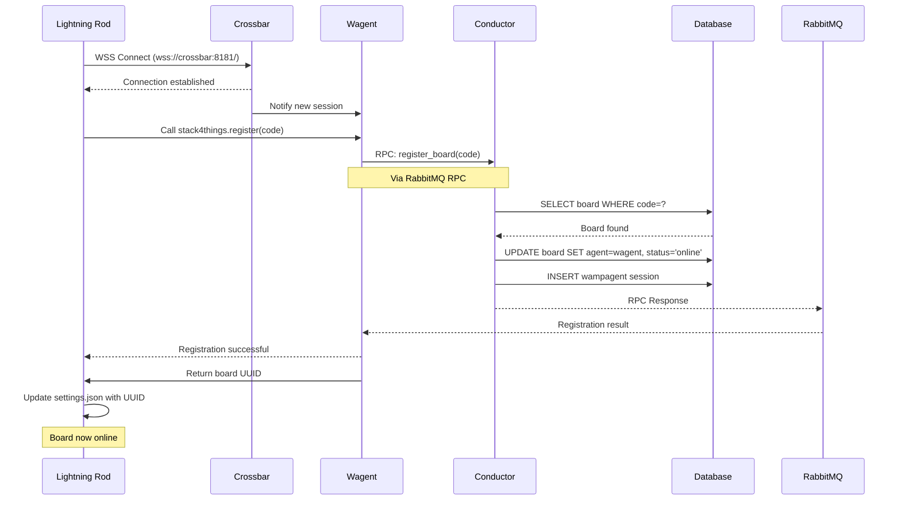
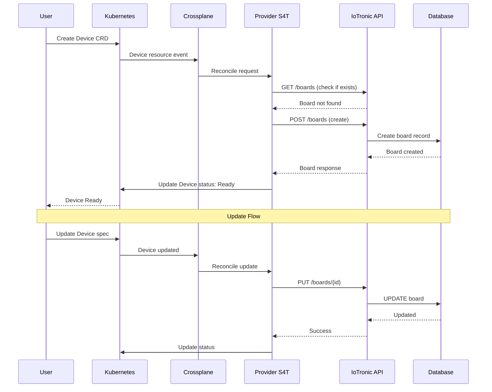
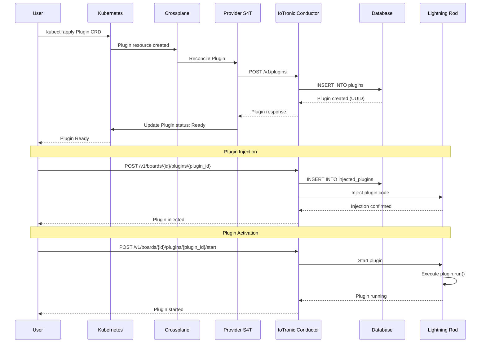
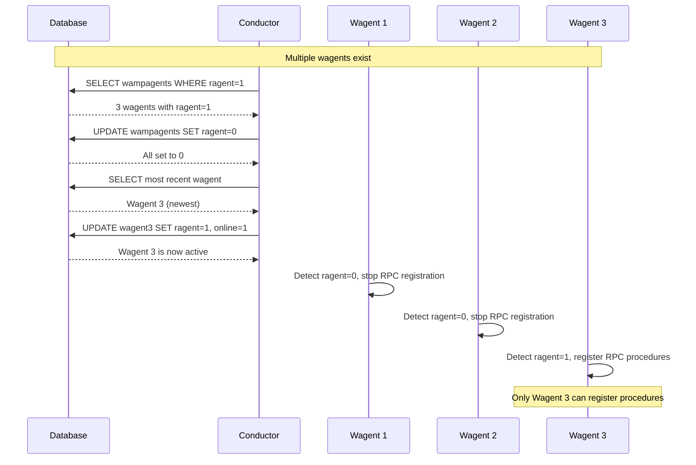

# S4T Deployment with Crossplane, Keycloak, and RBAC

This repository contains the complete deployment of Stack4Things, an open-source framework designed to address the complexities of IoT fleet management, on Kubernetes.

The deployment includes:
- **Stack4Things** core services (IoTronic Conductor, Wagent, Crossbar, Lightning Rod, UI)
- **Crossplane** for declarative infrastructure management
- **Keycloak** for OIDC authentication
- **Keystone** for federated identity management
- **RBAC Operator** for multi-tenant project isolation

## Prerequisites

To run this project correctly, ensure to install the following dependencies using this guide:

- [K3s](#k3s-installation): A lightweight alternative to Kubernetes
- [Helm](#helm-installation): A package manager for Kubernetes
- [MetalLB](#metallb-installation): A load balancer for Kubernetes clusters
- [Istio](#istio-installation-with-helm): A service mesh for traffic management 

If you already have those dependencies, jump to [S4T installation](#s4t---stack4things-deployment)

## K3s installation
  
```bash
curl -sfL https://get.k3s.io | sh -
sudo chmod 644 /etc/rancher/k3s/k3s.yaml
export KUBECONFIG=/etc/rancher/k3s/k3s.yaml
kubectl get nodes
```

If you find any kind of error, please refer to the official guide:

- [Quick-Start-K3s](https://docs.k3s.io/quick-start)

## Helm installation   
The [Helm project](https://helm.sh/docs/intro/install/) provides two official methods for downloading and installing Helm. In addition to these, the Helm community also provides other installation methods via various package managers.

### Script installation (recommended) 
Helm provides an installation script that automatically downloads and installs the latest version of Helm on your system.
  
You can download the script and run it locally. It is well documented, so you can read it in advance to understand what it does before running it.

```bash
curl -fsSL -o get_helm.sh https://raw.githubusercontent.com/helm/helm/main/scripts/get-helm-3
chmod 700 get_helm.sh
./get_helm.sh
```

### Binary installation
Every release of Helm provides binary releases for a variety of OSes. These binary versions can be manually downloaded and installed.

- Download your [desired version](https://github.com/helm/helm/releases)
- Unpack it (tar -zxvf helm-v3.0.0-linux-amd64.tar.gz)
- Find the helm binary in the unpacked directory, and move it to its desired destination (mv linux-amd64/helm /usr/local/bin/helm)


From there, you should be able to run the client and add the stable chart repository: helm help.

## MetalLB installation
### Installation by manifest (recommended)
To install MetalLB, apply the manifest:

```bash
kubectl apply -f https://raw.githubusercontent.com/metallb/metallb/v0.13.10/config/manifests/metallb-native.yaml
```
After the installation, if not present inside the folder ./metalLB, create a file named "metallb-config.yaml" and use the following configuration:
```
apiVersion: metallb.io/v1beta1
kind: IPAddressPool
metadata:
  name: default-pool
  namespace: metallb-system 
spec:
  addresses:
  - x.x.x.x-x.x.x.x # Change pool of IPs if needed
---
apiVersion: metallb.io/v1beta1
kind: L2Advertisement
metadata:
  name: l2-config
  namespace: metallb-system
```

Then, apply this configuaration in the cluster:
```
kubectl apply -f metallb-config.yaml
```
Use those commands to verify the correct creation of the metalLB pod and service.
```
kubectl get pods -n metallb-system
kubectl get svc -A
```

## Istio installation with Helm  

#### Adding the Helm repository of Istio  
```bash
helm repo add istio https://istio-release.storage.googleapis.com/charts
```

#### Updating repositories
```bash
helm repo update
```

#### Installation of the Istio base
```bash
helm install istio-base istio/base -n istio-system --set defaultRevision=default --create-namespace
>> Expected output:
- NAME: istio-base
- LAST DEPLOYED: **date**
- NAMESPACE: istio-system
- STATUS: deployed
- REVISION: 1
- TEST SUITE: None
- NOTES:
- Istio base successfully installed!
```

#### Verification of istio-base status
```bash
helm status istio-base -n istio-system
helm get all istio-base -n istio-system
helm ls -n istio-system
```
#### Installation of istiod service
```bash
helm install istiod istio/istiod -n istio-system --wait
```

#### Checking the installation
```bash
helm ls -n istio-system
helm status istiod -n istio-system
```

#### Checking the status of istiod pods
```bash
kubectl get deployments -n istio-system --output wide
>> Expected output:
NAME     READY   UP-TO-DATE   AVAILABLE   AGE  CONTAINERS  SELECTOR
istiod   1/1     1            1           23m  discovery   istio=pilot
```

#### Creating the namespace for the gateway
```bash
kubectl create namespace istio-ingress
>> Expected output: namespace/istio-ingress created
```

#### Installation of the Istio gateway
```bash
helm install istio-ingress istio/gateway -n istio-ingress --wait
```

#### Verification of services
```bash
kubectl get svc -A
>> Expected output: Istio created the LoadBalancer.
``` 

#### Verification of Istio Ingress pods  
```bash
kubectl get pods -n istio-ingress
>>Expected output:
NAME                             READY   STATUS
istio-ingress-<PodID>   1/1     Running
```

#### Verification of Istio Ingress Service
```bash
kubectl get svc -n istio-ingress
>> Expected output:
NAME            TYPE           CLUSTER-IP      EXTERNAL-IP     PORT(S)
istio-ingress   LoadBalancer   x.x.x.x         x.x.x.x         15021:30268/TCP,80:31240/TCP,443:32410/TCP
```

If you find any kind of error, please refer to the official guide:
- **Official Guide**: [Istio installation with Helm](https://istio.io/latest/docs/setup/install/helm/)  


## Crossplane Installation

Crossplane is an open-source Kubernetes add-on that enables platform teams to build control planes without writing code. In this deployment, Crossplane is used to manage Stack4Things resources (boards, plugins, services) declaratively.

### Installation

Crossplane is automatically installed by the deployment script. If you need to install it manually:

```bash
helm repo add crossplane-stable https://charts.crossplane.io/stable
helm repo update
helm upgrade --install crossplane crossplane-stable/crossplane \
  --namespace crossplane-system \
  --create-namespace \
  --wait
```

### Verify Installation

```bash
kubectl get pods -n crossplane-system
kubectl get crd | grep crossplane
```

### Crossplane Provider for Stack4Things

The deployment includes a custom Crossplane Provider for Stack4Things (S4T) that enables managing IoT boards, plugins, and services through Kubernetes Custom Resources.

The provider is automatically built and installed during deployment. It provides the following Custom Resources:

- **Device**: Represents an IoT board in Stack4Things
- **Plugin**: Represents a plugin that can be injected into boards
- **Service**: Represents a service that can be deployed on boards

### Provider Configuration

The provider requires a ProviderConfig that specifies:
- IoTronic API endpoint (FQDN: `http://iotronic-conductor.default.svc.cluster.local:8812/v1`)
- Keystone authentication endpoint (FQDN: `http://keystone.default.svc.cluster.local:5000/v3`)
- Credentials for API access (stored in Secret)

The deployment script automatically creates two ProviderConfigs:
- `s4t-provider-config`: For IoTronic API operations
- `s4t-provider-domain`: For Keystone authentication

Both use the same Secret (`s4t-credentials`) containing:
- Keystone username and password
- Project domain and user domain information

#### Provider Configuration Flow



To verify:

```bash
kubectl get providerconfig -n default
kubectl get secret s4t-credentials -n default
kubectl describe providerconfig s4t-provider-config -n default
```

## Architecture Overview

### System Architecture

The Stack4Things deployment with Crossplane integration consists of the following components:



### Component Interactions

**Core Services:**
- **MariaDB**: Stores all Stack4Things data (boards, plugins, services, wampagents)
- **Keystone**: Provides authentication and authorization
- **RabbitMQ**: Handles RPC communication between Conductor and Wagent
- **Crossbar**: WAMP router for WebSocket communication with Lightning Rod
- **IoTronic Conductor**: Main API server, manages boards and resources
- **IoTronic Wagent**: WAMP agent that handles board registration and communication
- **IoTronic UI**: Web dashboard (Horizon) for managing resources

**Crossplane Integration:**
- **Crossplane Core**: Kubernetes control plane extension
- **Crossplane Provider S4T**: Custom provider that translates Kubernetes CRDs to IoTronic API calls
- **Device CRD**: Kubernetes resource representing an IoT board
- **Plugin/Service CRDs**: Kubernetes resources for managing plugins and services

**Board Communication:**
- **Lightning Rod**: Agent running on each IoT board, connects to Crossbar via WSS
- Each Lightning Rod registers with Wagent, which manages board lifecycle

## S4T - Stack4Things Deployment

This guide describes how to clone, configure and start **Stack4Things** on Kubernetes with Crossplane integration.

### Improved Deployment Script

The improved deployment script (`deploy-complete-improved.sh`) automates the entire Stack4Things deployment including **Crossplane installation and configuration**. The script performs the following steps:

#### Deployment Steps

1. **Prerequisites Check**
   - Verifies K3s, Helm, MetalLB, and Istio installation
   - Configures MetalLB IP pool if needed
   - Sets up Istio ingress ports

2. **Stack4Things Core Services**
   - Deploys MariaDB database
   - Deploys Keystone authentication service
   - Deploys RabbitMQ message broker
   - Deploys Crossbar WAMP router
   - Deploys IoTronic Conductor (API server)
   - Deploys IoTronic Wagent (WAMP agent)
   - Deploys IoTronic UI (Horizon dashboard)
   - Deploys CA Service and Wstun

8. **Keycloak and Keystone Deployment** (Step 8)
   - Deploys Keycloak OIDC Identity Provider
   - Deploys PostgreSQL for Keycloak
   - Deploys Keystone with OIDC federation
   - Creates ConfigMaps for Keycloak realm and certificates
   - Creates ConfigMaps for Keystone configuration

9. **RBAC Operator Deployment** (Step 9)
   - Installs Project CRD
   - Builds and deploys RBAC Operator
   - Creates ServiceAccount and RBAC resources
   - Sets up ClusterRole for project creation

3. **Crossplane Installation** (Step 5)
   - Adds Crossplane Helm repository
   - Installs Crossplane in `crossplane-system` namespace
   - Waits for Crossplane pods to be ready

4. **Crossplane Provider S4T Installation** (Step 6)
   - Locates crossplane-provider directory
   - Builds provider image (if Makefile exists)
   - Installs provider CRDs
   - Installs provider resource via kubectl or Helm
   - Verifies provider installation

5. **Provider Configuration** (Step 7)
   - Creates ProviderConfig with IoTronic API endpoint
   - Creates ProviderConfig with Keystone endpoint
   - Creates Secret with authentication credentials
   - Configures FQDN endpoints for all services

6. **Database Fixes** (Step 7.1-7.2)
   - Fixes wagent duplicates (ensures only one `ragent=1`)
   - Fixes board status NULL issues
   - Updates boards to use active wagent

7. **Final Verification** (Step 10)
   - Checks pod status for all services
   - Verifies Crossplane installation
   - Verifies Keycloak and Keystone status
   - Verifies RBAC Operator status
   - Provides dashboard access information

#### Deployment Sequence

The following diagram shows the complete deployment process:



To run the deployment:

```bash
cd stack4things-improved
./deploy-complete-improved.sh
```

The script automatically:
- Checks and installs prerequisites (MetalLB, Istio if needed)
- Deploys all Stack4Things components
- **Installs and configures Crossplane** (Steps 5-7)
- Builds and installs the Crossplane Provider S4T
- Configures ProviderConfig with correct endpoints
- Fixes common database issues automatically
- Provides dashboard access information

### Manual Deployment (Legacy)

If you prefer manual deployment:

1. Clone this repository:
```
git clone https://github.com/MDSLab/Stack4Things_k3s_deployment.git
```
2. Move to correct directory
``` 
cd Stack4Things_k3s_deployment
```
3. Apply YAML files to the Kubernetes cluster:
```bash
cd yaml_file
kubectl apply -f .
```
4. Check that the Pods are active:
```bash
kubectl get pods
```
5. Check available services:
```bash
kubectl get svc
```

### Exposing port on Istio
#### Example
Modify the Service for istio-ingress to include port 8181.
Run the following command to edit the existing configuration:

```
kubectl edit svc istio-ingress -n istio-ingress
```
Then, add the 8181 port under spec.ports:

```
spec:
  ports:
    - name: tcp-crossbar
      port: 8181
      targetPort: 8181
      protocol: TCP
```

Save and close.

### It is suggested to expose those ports: 80-443-8181-1474-8812-8080-5672-15672-8070
#### svc edit
```
ports:
    - name: status-port
      nodePort: 31965
      port: 15021
      protocol: TCP
      targetPort: 15021
    - name: http2
      nodePort: 31540
      port: 80
      protocol: TCP
      targetPort: 80
    - name: https
      nodePort: 31702
      port: 443
      protocol: TCP
      targetPort: 443
    - name: tcp-crossbar
      nodePort: 32298
      port: 8181
      protocol: TCP
      targetPort: 8181
    - name: lr
      nodePort: 30772
      port: 1474
      protocol: TCP
      targetPort: 1474
    - name: conductor
      nodePort: 31711
      port: 8812
      protocol: TCP
      targetPort: 8812
    - name: wstun
      nodePort: 30147
      port: 8080
      protocol: TCP
      targetPort: 8080
    - name: rabbit
      nodePort: 30320
      port: 5672
      protocol: TCP
      targetPort: 5672
    - name: rabbitui
      nodePort: 30998
      port: 15672
      protocol: TCP
      targetPort: 15672
```

### Creating the Gateway and VirtualService for Iotronic-UI and Crossbar

- Enter the folder where the configuration file is contained and apply the YAML file to the Kubernetes cluster:
```bash
cd istioconf
kubectl apply -f .
```

- Verify that the resources have been created correctly:
```bash
kubectl describe virtualservice iotronic-ui
kubectl describe virtualservice crossbar
kubectl describe virtualservice lightning-rod
```

- Check the istio-ingress service to obtain the public IP of the load balancer:
```bash
kubectl get svc istio-ingress -n istio-ingress
```
- Output expetation:
```bash
NAME            TYPE           CLUSTER-IP     EXTERNAL-IP     PORT(S)                                                     AGE
istio-ingress   LoadBalancer   10.43.24.188   x.x.x.x   15021:32693/TCP,80:30914/TCP,443:32500/TCP,8181:30946/TCP   4d21h
```

- Verify the creation of the VirtualService:
```bash
kubectl get virtualservice
```

-  Output expetation:
```bash
NAME            GATEWAYS                    HOSTS   AGE
crossbar        ["crossbar-gateway"]        ["*"]   24h
iotronic-ui     ["iotronic-ui-gateway"]     ["*"]   24h
lightning-rod   ["lightning-rod-gateway"]   ["*"]   20m
```

- Check the gateway:
```bash
kubectl get gateway
```

- Output expetation:
```bash
NAME                    AGE
crossbar-gateway        24h
iotronic-ui-gateway     24h
lightning-rod-gateway   20m
```

### Testing service access
- Use curl to test access to the Iotronic UI via the istio-ingress IP:
```bash
curl x.x.x.x/iotronic-ui
```
Check also via browser the access to the page:
```
http://x.x.x.x/horizon/auth/login/?next=/horizon/
```


## Common errors
1. **Lack of permission on "/etc/rancher/k3s/k3s.yaml" file**
```
error: error loading config file "/etc/rancher/k3s/k3s.yaml": open /etc/rancher/k3s/k3s.yaml: permission denied
```

- **Check Permissions:**
You can check the current permissions of the file using the ls -l command:
```
ls -l /etc/rancher/k3s/k3s.yaml
```
This will display the file's permissions. You should see something like this:

```
-rw-r--r-- 1 root root 1234 Mar 19 12:34 /etc/rancher/k3s/k3s.yaml
```

- **Change Permissions (if necessary):**
If the file is not readable by the user you're logged in as, you can either change its permissions or use sudo to access it.

To change the permissions so all users can read the file, you can run:
```
sudo chmod 644 /etc/rancher/k3s/k3s.yaml
```

## Authentication and Project Management

### Keycloak and Keystone Integration

The deployment includes Keycloak as an OIDC Identity Provider and Keystone for federated identity management:

- **Keycloak**: Provides OIDC authentication for Kubernetes API server
- **Keystone**: Federated with Keycloak, manages OpenStack-style projects and groups
- **OIDC Groups**: Follow the convention `s4t:owner-project:role` where role can be:
  - `admin_iot_project`: Full administrative access
  - `manager_iot_project`: Developer/power-user access
  - `user_iot`: Read-only access

### RBAC Operator and Project CRD

The RBAC Operator automatically manages project isolation:

1. **Project Creation**: When a user creates a `Project` CRD:
   ```yaml
   apiVersion: s4t.s4t.io/v1alpha1
   kind: Project
   metadata:
     name: my-project
   spec:
     projectName: my-project
     owner: ""  # Auto-populated by mutating webhook
   ```

2. **Automatic Resource Creation**:
   - Dedicated namespace for the project
   - Project-level Roles (admin, manager, user)
   - RoleBindings based on OIDC groups
   - Keystone authentication Secret

3. **Group-Based Access**: Users are granted access based on their OIDC group membership following the `s4t:owner-project:role` pattern.

### Configuring k3s for OIDC

To enable OIDC authentication with Keycloak:

```bash
cd stack4things-improved
sudo ./scripts/configure-k3s-oidc.sh
```

This configures k3s with:
- OIDC issuer URL: `https://keycloak.keycloak.svc.cluster.local:8443/realms/stack4things`
- Client ID: `kubernetes`
- Username claim: `preferred_username`
- Groups claim: `groups`

### Project Management Flow

The following diagram shows the complete project creation and RBAC setup flow:



## Creating and Managing Boards with Crossplane

Crossplane enables declarative management of Stack4Things boards through Kubernetes Custom Resources. Instead of using the IoTronic API directly, you can create and manage boards using `kubectl` and YAML files.

### Board Creation Flow

The following sequence diagram shows how a board is created and registered through Crossplane:



### Creating a Board with Crossplane

Create a board by applying a Device resource:

```bash
cat <<EOF | kubectl apply -f -
apiVersion: iot.s4t.crossplane.io/v1alpha1
kind: Device
metadata:
  name: my-board
  namespace: default
spec:
  forProvider:
    code: "MY-BOARD-CODE-12345"
    name: "My Board"
    type: "virtual"
    location:
    - latitude: "38.1157"
      longitude: "13.3613"
      altitude: "0"
  providerConfigRef:
    name: s4t-provider-domain
EOF
```

Verify the board was created:

```bash
kubectl get device -n default
kubectl describe device my-board -n default
```

The board will be automatically registered in IoTronic. After creation, you need to deploy a Lightning Rod for the board (see below).

### Board Registration Sequence

When a Lightning Rod connects for the first time:



### Crossplane Provider Workflow

How Crossplane Provider S4T manages resources:



### Communication Protocols

**WAMP (WebSocket Application Messaging Protocol):**
- Used for real-time communication between Lightning Rod and Crossbar
- Protocol: WSS (WebSocket Secure)
- Realm: `s4t`
- Port: 8181

**RPC (Remote Procedure Call):**
- Used for communication between Wagent and Conductor
- Transport: RabbitMQ (AMQP)
- Pattern: Request-Reply
- Topics: `iotronic.conductor_manager` (Conductor) and `s4t` (Wagent)

**REST API:**
- Used by Crossplane Provider to interact with IoTronic
- Endpoint: `http://iotronic-conductor:8812/v1`
- Authentication: Keystone tokens

### Listing Boards

```bash
# List Crossplane Device resources
kubectl get device -n default

# List boards in IoTronic database
DB_POD=$(kubectl get pod -n default -l io.kompose.service=iotronic-db -o jsonpath='{.items[0].metadata.name}')
kubectl exec -n default "$DB_POD" -- mysql -uroot -ps4t iotronic -e "SELECT name, code, status FROM boards;"
```

### Deleting a Board

```bash
kubectl delete device my-board -n default
```

This will delete the board from both Crossplane and IoTronic.

### Cleanup All Boards

To clean up all boards and Lightning Rod instances:

```bash
cd stack4things-improved
./scripts/cleanup-all-boards.sh
```

This script will:
- Delete all Crossplane Device resources
- Delete all Lightning Rod pods and deployments
- Clean up the database (boards, plugins, services, WAMP sessions)
- Ensure only one wagent is set as registration agent
- Fix wagent duplicates automatically

### Create Multiple Boards

To create 5 boards automatically:

```bash
cd stack4things-improved
./scripts/create-all-boards.sh 5
```

This script will:
- Create 5 boards via Crossplane Device resources
- Create Lightning Rod for each board
- Configure settings.json with correct WSS URL
- Update all boards to use the active wagent
- Wait for connection and show final status

### Create Single Board

To create a Lightning Rod for a specific board:

```bash
cd stack4things-improved
./scripts/create-lightning-rod-for-board.sh <BOARD_CODE>
```

Example:
```bash
./scripts/create-lightning-rod-for-board.sh TEST-BOARD-1234567890-1
```

### Compile Settings for All Boards

To update settings.json for all existing boards:

```bash
cd stack4things-improved
./scripts/compile-settings-for-all-boards.sh
```

## Creating and Managing Plugins with Crossplane

Crossplane enables declarative management of Stack4Things plugins through Kubernetes Custom Resources. Plugins are Python scripts that run on IoT boards via Lightning Rod.

### Plugin Structure

A Stack4Things plugin must:
- Inherit from `Plugin.Plugin` base class
- Implement a `Worker` class with `run()` method
- Use `oslo_log` for logging
- Put results in `self.q_result` queue

### Creating a Plugin

#### Simple Example Plugin

Create a simple environmental data logger plugin:

```bash
cd stack4things-improved
./scripts/create-plugin.sh simple-environmental-logger examples/plugin-simple-example.yaml
```

Or create a plugin directly using kubectl:

```bash
cat <<EOF | kubectl apply -f -
apiVersion: iot.s4t.crossplane.io/v1alpha1
kind: Plugin
metadata:
  name: my-plugin
  namespace: default
spec:
  forProvider:
    name: "My Plugin"
    code: |
      from iotronic_lightningrod.plugins import Plugin
      from oslo_log import log as logging
      import time
      
      LOG = logging.getLogger(__name__)
      
      class Worker(Plugin.Plugin):
          def __init__(self, uuid, name, q_result, params=None):
              super(Worker, self).__init__(uuid, name, q_result, params)
              
          def run(self):
              LOG.info(f"Plugin {self.name} started")
              LOG.info(f"Input parameters: {self.params}")
              LOG.info("Plugin process completed!")
              self.q_result.put("SUCCESS")
    parameters:
      interval: 30
  providerConfigRef:
    name: s4t-provider-domain
  deletionPolicy: Delete
EOF
```

#### Environmental Monitor Plugin

A more complete example that simulates environmental monitoring:

```bash
cd stack4things-improved
./scripts/create-plugin.sh environmental-monitor examples/plugin-environmental-monitor.yaml
```

This plugin:
- Logs simulated environmental data (temperature, humidity, pressure, wind)
- Runs continuously with configurable interval
- Uses structured logging
- Handles errors gracefully

### Plugin Examples

Example plugins are available in the `examples/` directory:

- `plugin-simple-example.yaml`: Basic plugin template
- `plugin-environmental-monitor.yaml`: Environmental data monitoring plugin

### Injecting Plugin into a Board

After creating a plugin, inject it into a board. There are two methods:

#### Method 1: Using BoardPluginInjection CRD (Recommended)

This method uses Crossplane CRD for declarative injection:

```bash
cd stack4things-improved
./scripts/inject-plugin-using-crd.sh <BOARD_CODE> <PLUGIN_NAME>
```

Example:
```bash
./scripts/inject-plugin-using-crd.sh TEST-BOARD-1234567890-1 simple-environmental-logger
```

#### Method 2: Using Direct API Call

This method directly calls the IoTronic API:

```bash
cd stack4things-improved
./scripts/inject-plugin-to-board.sh <BOARD_CODE> <PLUGIN_NAME>
```

Example:
```bash
./scripts/inject-plugin-to-board.sh TEST-BOARD-1234567890-1 simple-environmental-logger
```

**Important**: The board must be **online** (Lightning Rod connected) for injection to work.

### Verifying Plugins

To check plugin status and injections:

```bash
cd stack4things-improved
./scripts/verify-plugins.sh
```

This script shows:
- Crossplane Plugin resources
- Plugins in database
- Injected plugins in boards
- BoardPluginInjection CRDs

### Plugin Lifecycle



### Listing Plugins

```bash
# List Crossplane Plugin resources
kubectl get plugin -n default

# List plugins in IoTronic database
DB_POD=$(kubectl get pod -n default -l io.kompose.service=iotronic-db -o jsonpath='{.items[0].metadata.name}')
kubectl exec -n default "$DB_POD" -- mysql -uroot -ps4t iotronic -e "SELECT name, uuid FROM plugins;"
```

### Deleting a Plugin

```bash
kubectl delete plugin my-plugin -n default
```

This will delete the plugin from both Crossplane and IoTronic.

### Plugin Development Tips

1. **Use oslo_log for logging**: All logs will appear in Lightning Rod logs
2. **Handle parameters**: Access via `self.params` dictionary
3. **Graceful shutdown**: Check `self.running` flag in loops
4. **Error handling**: Wrap main logic in try/except blocks
5. **Result reporting**: Use `self.q_result.put()` to report completion status

Example plugin structure:
```python
from iotronic_lightningrod.modules.plugins import Plugin
from oslo_log import log as logging
import time

LOG = logging.getLogger(__name__)

class Worker(Plugin.Plugin):
    def __init__(self, uuid, name, q_result=None, params=None):
        super(Worker, self).__init__(uuid, name, q_result, params)
        self.interval = int(params.get('interval', 30)) if params else 30
        
    def run(self):
        LOG.info(f"Plugin {self.name} started")
        try:
            while self._is_running:
                # Your plugin logic here
                LOG.info("Processing...")
                time.sleep(self.interval)
        except Exception as e:
            LOG.error(f"Plugin error: {str(e)}")
            if self.q_result:
                self.q_result.put(f"ERROR: {str(e)}")
        finally:
            LOG.info("Plugin stopped")
            if self.q_result:
                self.q_result.put("SUCCESS")
```

**Important Notes:**
- Use `from iotronic_lightningrod.modules.plugins import Plugin` (not `iotronic_lightningrod.plugins`)
- Use `self._is_running` (not `self.running`) to check if plugin should continue
- `q_result` parameter is optional in `__init__` (can be `None`)
- Always check if `self.q_result` exists before calling `put()`

## Important Notes

### settings.json Configuration

The `settings.json` file is automatically configured with:
- **Board code**: Registration token from OpenStack
- **WSS URL**: `wss://crossbar.default.svc.cluster.local:8181/`
- **WAMP Realm**: `s4t`
- **UUID**: Will be added by the cloud on first connection (do NOT include it manually)

### Wagent Management

The Wagent (WAMP Agent) is a critical component that handles board registration and communication. The system architecture requires exactly **ONE active wagent** at any time.

#### Wagent Responsibilities

1. **Board Registration**: Registers new boards when Lightning Rod connects
2. **RPC Procedure Registration**: Registers WAMP procedures for board communication
3. **Session Management**: Manages WAMP sessions with Lightning Rod instances
4. **Database Updates**: Updates board status and agent assignments

#### Wagent Selection Process



The deployment script automatically ensures:
- Only one wagent is set as registration agent (`ragent=1`)
- All boards use the active wagent
- Wagent duplicates are automatically fixed (Step 7.1)

**Critical**: The system requires exactly ONE wagent with `ragent=1` and `online=1`. Multiple wagents with `ragent=1` will cause:
- RPC procedure registration conflicts (`procedure_already_exists` errors)
- Board connection failures (`no callee registered` errors)
- API errors ("unable to retrieve board list" - SQL MultipleResultsFound)

The deployment script (Step 7.1) automatically fixes this issue, but if you encounter problems, see "Common Issues and Fixes" section below.

### Crossplane Provider Management

The Crossplane Provider S4T must be properly configured to manage Stack4Things resources. The deployment script automatically:

1. Builds the provider from the `crossplane-provider` directory
2. Installs the provider CRDs
3. Creates the ProviderConfig with correct endpoints
4. Sets up authentication credentials

To verify the provider is working:

```bash
# Check provider status
kubectl get provider -n crossplane-system

# Check ProviderConfig
kubectl get providerconfig -n default

# Check provider pods
kubectl get pods -n crossplane-system | grep s4t
```

If the provider is not working, check the logs:

```bash
kubectl logs -n crossplane-system -l pkg.crossplane.io/provider=s4t
```

### Common Issues and Fixes

1. **Board remains "registered" instead of "online"**:
   - **Cause**: Board is trying to connect to an inactive or non-existent wagent
   - **Fix**:
     ```bash
     DB_POD=$(kubectl get pod -n default -l io.kompose.service=iotronic-db -o jsonpath='{.items[0].metadata.name}')
     ACTIVE_WAGENT=$(kubectl exec -n default "$DB_POD" -- mysql -uroot -ps4t iotronic -Nse "SELECT hostname FROM wampagents WHERE ragent=1 AND online=1 ORDER BY created_at DESC LIMIT 1;")
     kubectl exec -n default "$DB_POD" -- mysql -uroot -ps4t iotronic -e "UPDATE boards SET agent='$ACTIVE_WAGENT', status='registered' WHERE status='offline' OR status='registered';"
     kubectl delete pod -n default -l app=lightning-rod
     ```
   - Wait 2-3 minutes for boards to reconnect

2. **Multiple wagents with `ragent=1` (wagent duplicates)**:
   - **Cause**: Multiple wagent instances trying to register the same RPC procedures
   - **Fix**:
     ```bash
     DB_POD=$(kubectl get pod -n default -l io.kompose.service=iotronic-db -o jsonpath='{.items[0].metadata.name}')
     kubectl exec -n default "$DB_POD" -- mysql -uroot -ps4t iotronic -e "
       UPDATE wampagents SET ragent=0 WHERE ragent=1;
       UPDATE wampagents SET ragent=1, online=1 WHERE hostname=(SELECT hostname FROM (SELECT hostname FROM wampagents ORDER BY created_at DESC LIMIT 1) AS t);
     "
     kubectl delete pod -n default -l io.kompose.service=iotronic-conductor
     kubectl delete pod -n default -l io.kompose.service=iotronic-wagent
     ```
   - This is automatically fixed in Step 7.1 of the deployment script

3. **API returns "unable to retrieve board list"**:
   - **Cause**: Multiple wagents with `ragent=1` causing SQL query issues
   - **Fix**: Same as issue #2 (fix wagent duplicates)
   - Restart conductor after fixing

4. **Board status is NULL**:
   - **Cause**: Board was created but status was never set
   - **Fix**:
     ```bash
     DB_POD=$(kubectl get pod -n default -l io.kompose.service=iotronic-db -o jsonpath='{.items[0].metadata.name}')
     kubectl exec -n default "$DB_POD" -- mysql -uroot -ps4t iotronic -e "UPDATE boards SET status='registered' WHERE status IS NULL OR status = '';"
     ```
   - This is automatically fixed in Step 7.2 of the deployment script

5. **Board name already exists error**:
   - **Cause**: Board with same name already exists in database
   - **Fix**: Delete old boards or use unique names
   - Use `cleanup-all-boards.sh` to clean all boards

6. **Lightning Rod error: "no callee registered for procedure <stack4things.register>"**:
   - **Cause**: Wagent is not registering RPC procedures correctly, or board is pointing to wrong wagent
   - **Fix**:
     ```bash
     # Fix wagent duplicates first (see issue #2)
     # Then update all boards with active wagent (see issue #1)
     # Restart wagent and conductor
     kubectl delete pod -n default -l io.kompose.service=iotronic-wagent
     kubectl delete pod -n default -l io.kompose.service=iotronic-conductor
     kubectl delete pod -n default -l app=lightning-rod
     ```
   - Wait 3-5 minutes for full reconnection

7. **Only some boards are online**:
   - **Cause**: Boards have different wagent assignments, some pointing to inactive wagents
   - **Fix**:
     ```bash
     DB_POD=$(kubectl get pod -n default -l io.kompose.service=iotronic-db -o jsonpath='{.items[0].metadata.name}')
     ACTIVE_WAGENT=$(kubectl exec -n default "$DB_POD" -- mysql -uroot -ps4t iotronic -Nse "SELECT hostname FROM wampagents WHERE ragent=1 AND online=1 ORDER BY created_at DESC LIMIT 1;")
     kubectl exec -n default "$DB_POD" -- mysql -uroot -ps4t iotronic -e "UPDATE boards SET agent='$ACTIVE_WAGENT', status='registered' WHERE status != 'online';"
     kubectl delete pod -n default -l app=lightning-rod
     ```
   - Wait 2-3 minutes for all boards to reconnect
